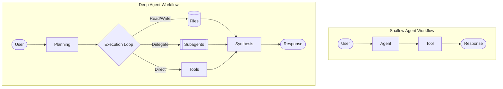

# Deep Agents: Why Most AI Agents Are Shallow (And How to Fix It)

A complete guide to building AI agents that actually plan, delegate, and remember. Learn the architecture behind Claude Code, Deep Research, and how to build production-ready deep agents with LangChain.


## Table of Contents

1. The Problem: Why Most Agents Are Shallow
2. What Makes an Agent Deep?
3. Deep Agents in the Wild
4. Pillar 1: Planning Tools
5. Pillar 2: File Systems
6. Pillar 3: Subagents
7. Pillar 4: Detailed System Prompts
8. The Bottom Line

## The Problem: Why Most Agents Are Shallow

You build an AI agent. It can search the web, analyze data, even write code. You give it a task: "Research the top 5 AI companies hiring in San Francisco, analyze their job openings, and write personalized cover letters for each."

Your agent searches once. Gets overwhelmed. Writes one generic cover letter. Forgets companies 2 through 5. Fails completely.

This is what I call a shallow agent. Using an LLM to call tools in a loop is the simplest form of an agent, but this architecture yields agents that fail to plan and act over longer, more complex tasks.

```text
User: "Find me jobs and write cover letters for 5 companies"

Shallow Agent Process:
→ Searches: "AI companies SF hiring"
→ Gets 50 results, context starts filling up
→ Picks first company, writes generic letter
→ Tries to continue but context is full of search results
→ Forgets the task had 5 companies
→ Returns incomplete work

Result: FAILURE
```

Now watch what happens with a deep agent:

```text
User: "Find me jobs and write cover letters for 5 companies"

Deep Agent Process:
→ Writes TODO list:
   1. Search for AI companies in SF
   2. Research each company (spawn subagent for each)
   3. Find job openings for each
   4. Write personalized cover letters
→ Executes step 1: Searches broadly
→ Stores company list in companies.md file
→ For each company:
   → Spawns research subagent with isolated context
   → Subagent deep-dives on that company
   → Stores findings in company_X_research.md
→ Reads research files
→ Writes 5 personalized, specific cover letters

Result: SUCCESS
```

## What Makes an Agent Deep?

The difference is not the core algorithm. Both agents are just LLMs running in a loop calling tools. The difference is the architecture around that loop.


The four pillars are:

1. Planning - breaks down the task before starting
2. File system - manages context by offloading to files
3. Subagents - delegates specialized work
4. Detailed prompts - tells the model how to use the other three

## Deep Agents in the Wild

Claude Code, OpenAI Deep Research, and Manus all converged on the same pattern.

Claude Code's TODO list tool is effectively a no-op. It does not execute work. It just stores planning steps. That is the point: it forces the agent to think before acting.

```python
from langchain_core.tools import tool

@tool
def write_todos(todos: list[str]) -> str:
	"""Write or update your TODO list."""
	return f"Updated TODOs: {', '.join(todos)}"
```

Subagents matter because they keep context isolated and clean. The main agent orchestrates without getting bogged down in the details.



## Pillar 1: Planning Tools

The most important tool in a deep agent does almost nothing. It just stores a list of todos.

```python
@tool
def write_todos(todos: list[str]) -> str:
	"""
	Write or update your TODO list.

	Use this to break down complex tasks into steps, track progress,
	and update the plan as new information emerges.
	"""
	return f"Updated TODOs: {', '.join(todos)}"
```

The value is not in what the tool does. The value is in making the LLM call it.

## Pillar 2: File Systems

You cannot keep everything in the context window forever. Deep agents write findings to files as they discover them, then read only what they need for the current step.

```python
# Research a company and store the result
research = agent.internet_search("OpenAI company culture")
agent.write_file("openai_research.md", research)

# Later, load just what you need
research = agent.read_file("openai_research.md")
letter = generate_cover_letter(job_posting, research)
```

## Pillar 3: Subagents

Subagents allow parallel work while keeping context isolated.

Without subagents, the main agent context fills with company research, TODOs, and outputs. With subagents, each company gets its own focused context and its own file.

## Pillar 4: Detailed System Prompts

The final pillar is often overlooked. Detailed prompts tell the agent how to plan, when to delegate, and when to store work in files.

## The Bottom Line

The solution is not a different algorithm. It is the same algorithm with four architectural additions: planning, files, subagents, and better prompts.

If you want an agent that can handle real work, you need all four.
A complete guide to building AI agents that actually plan, delegate, and remember. Learn the architecture behind Claude Code, Deep Research, and how to build production-ready deep agents with LangChain.

## AI Agents 101: The 60-Second Primer

New to AI agents? Here's what you need to know:

What's an AI agent? An LLM (like ChatGPT) that can use tools to complete tasks. Tools are functions the LLM can call, like search, code execution, database queries, and sending emails.

How do they work? Agents follow a simple loop called the ReAct pattern (Reasoning + Acting):

```text
1. Think: "I need to search for quantum computing news"
2. Act: Call search_tool("quantum computing 2024")
3. Observe: Read the search results
4. Think: "Now I have the info, I can answer"
5. Respond: Provide answer to user

Repeat until task is complete.
```

The ReAct loop works great for simple tasks like "What's the weather in Tokyo?" or "Summarize this article."

But for complex, multi-step tasks? Simple agents fail spectacularly. They forget steps, lose context, and produce incomplete work.

## Why Most Agents Are Shallow

You build an AI agent. It can search the web, analyze data, even write code. You give it a task: "Research the top 5 AI companies hiring in San Francisco, analyze their job openings, and write personalized cover letters for each."

Your agent searches once. Gets overwhelmed. Writes one generic cover letter. Forgets companies 2 through 5. Fails completely.

This is what I call a "shallow" agent. Using an LLM to call tools in a loop is the simplest form of an agent, but this architecture yields agents that fail to plan and act over longer, more complex tasks.

## What Happens With a Deep Agent

Deep agents write a plan first, store intermediate findings in files, and delegate focused work to subagents. That lets them handle more complex tasks without losing context.

The difference comes down to four capabilities:

1. Planning - Breaks down the task before starting
2. File system - Manages context by offloading to files
3. Subagents - Delegates specialized work
4. Detailed prompts - Knows how to use these capabilities

Those are the ingredients that make an agent deep.
