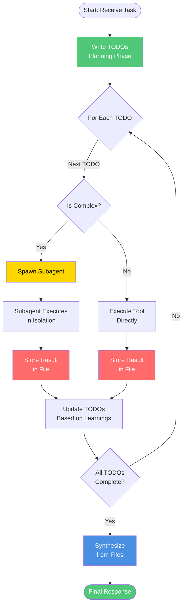

# Deep Agents: Why Most AI Agents Are Shallow (And How to Fix It)

A complete guide to building AI agents that actually plan, delegate, and remember. Learn the architecture behind Claude Code, Deep Research, and how to build production-ready deep agents with LangChain.

## Table of Contents

1. The Problem: Why Most Agents Are Shallow
2. What Makes an Agent Deep?
3. Deep Agents in the Wild
4. Pillar 1: Planning Tools
5. Pillar 2: File Systems
6. Pillar 3: Subagents
7. Pillar 4: Detailed System Prompts
8. The Bottom Line

## The Problem: Why Most Agents Are Shallow

You build an AI agent. It can search the web, analyze data, even write code. You give it a task: "Research the top 5 AI companies hiring in San Francisco, analyze their job openings, and write personalized cover letters for each."

Your agent searches once. Gets overwhelmed. Writes one generic cover letter. Forgets companies 2 through 5. Fails completely.

This is what I call a shallow agent. Using an LLM to call tools in a loop is the simplest form of an agent, but this architecture yields agents that fail to plan and act over longer, more complex tasks.

```text
User: "Find me jobs and write cover letters for 5 companies"

Shallow Agent Process:
→ Searches: "AI companies SF hiring"
→ Gets 50 results, context starts filling up
→ Picks first company, writes generic letter
→ Tries to continue but context is full of search results
→ Forgets the task had 5 companies
→ Returns incomplete work

Result: FAILURE
```

Now watch what happens with a deep agent:

```text
User: "Find me jobs and write cover letters for 5 companies"

Deep Agent Process:
→ Writes TODO list:
   1. Search for AI companies in SF
   2. Research each company (spawn subagent for each)
   3. Find job openings for each
   4. Write personalized cover letters
→ Executes step 1: Searches broadly
→ Stores company list in companies.md file
→ For each company:
   → Spawns research subagent with isolated context
   → Subagent deep-dives on that company
   → Stores findings in company_X_research.md
→ Reads research files
→ Writes 5 personalized, specific cover letters

Result: SUCCESS
```

## What Makes an Agent Deep?

The difference is not the core algorithm. Both agents are just LLMs running in a loop calling tools. The difference is the architecture around that loop.

The four pillars are:

1. Planning - breaks down the task before starting
2. File system - manages context by offloading to files
3. Subagents - delegates specialized work
4. Detailed prompts - tells the model how to use the other three

## Deep Agents in the Wild

Claude Code, OpenAI Deep Research, and Manus all converged on the same pattern.

Claude Code's TODO list tool is effectively a no-op. It does not execute work. It just stores planning steps. That is the point: it forces the agent to think before acting.

```python
from langchain_core.tools import tool

@tool
def write_todos(todos: list[str]) -> str:
	"""Write or update your TODO list."""
	return f"Updated TODOs: {', '.join(todos)}"
```

Subagents matter because they keep context isolated and clean. The main agent orchestrates without getting bogged down in the details.


## Pillar 1: Planning Tools

The most important tool in a deep agent does almost nothing. It just stores a list of todos.

```python
@tool
def write_todos(todos: list[str]) -> str:
	"""
	Write or update your TODO list.

	Use this to break down complex tasks into steps, track progress,
	and update the plan as new information emerges.
	"""
	return f"Updated TODOs: {', '.join(todos)}"
```

The value is not in what the tool does. The value is in making the LLM call it.

## Pillar 2: File Systems

You cannot keep everything in the context window forever. Deep agents write findings to files as they discover them, then read only what they need for the current step.

```python
# Research a company and store the result
research = agent.internet_search("OpenAI company culture")
agent.write_file("openai_research.md", research)

# Later, load just what you need
research = agent.read_file("openai_research.md")
letter = generate_cover_letter(job_posting, research)
```

## Pillar 3: Subagents

Subagents allow parallel work while keeping context isolated.

Without subagents, the main agent context fills with company research, TODOs, and outputs. With subagents, each company gets its own focused context and its own file.

## Pillar 4: Detailed System Prompts

The final pillar is often overlooked. Detailed prompts tell the agent how to plan, when to delegate, and when to store work in files.

## The Bottom Line

The solution is not a different algorithm. It is the same algorithm with four architectural additions: planning, files, subagents, and better prompts.

If you want an agent that can handle real work, you need all four.
A complete guide to building AI agents that actually plan, delegate, and remember. Learn the architecture behind Claude Code, Deep Research, and how to build production-ready deep agents with LangChain.

## Deep Agents in the Wild

Claude Code changed the game. Not because it invented something new, but because people started using it for tasks way beyond coding. Someone used it to plan a wedding, another to research investments, another to write a novel outline.

What does Claude Code have that makes this possible? A long, detailed system prompt with explicit instructions on every tool and workflow patterns for different task types. A TODO list tool that's essentially a no-op but forces the agent to plan before acting. Subagent spawning for context isolation. And file system access for persistent memory.

OpenAI's Deep Research uses the same pattern: planning phase before execution, intermediate results storage, parallel research threads, and detailed methodology instructions. Manus makes heavy use of file systems for agent memory and context engineering at scale.

All three independently arrived at the same architecture. This is not coincidence. This is the architecture that works for complex, multi-step tasks. The core insight is that the algorithm is the same — an LLM running in a loop calling tools — but the difference is in what surrounds that loop: detailed system prompts, planning tools, file systems, and subagents.

## Shallow vs Deep: Code Comparison

**Shallow agent pattern:**

```python
def shallow_agent(task):
    history = []
    while not done:
        thought = llm.generate(task + history)
        action = select_tool(thought)
        result = execute(action)
        history.append(result)
```

Everything crammed into one context. No plan. No way to delegate. No persistent storage. Works for simple tasks, fails on anything complex.

**Deep agent pattern:**

```python
def deep_agent(task):
    todos = agent.write_todos(task)
    for subtask in todos:
        if needs_deep_focus(subtask):
            subagent = spawn_subagent(task=subtask)
            result = subagent.run()
            filesystem.write(f"{subtask}.md", result)
        else:
            result = execute_tools(subtask)
        todos = agent.update_todos(result)
    research = filesystem.read_all("*.md")
    return synthesize(research)
```

Planning, file storage, subagent delegation, dynamic adaptation. The same core loop, but the architecture around it makes all the difference.

## How Deep Agents Compare to Traditional Ones

| Capability | Shallow Agent | Deep Agent |
|---|---|---|
| Planning | Reactive, no explicit plan | Proactive with TODO lists |
| Memory | Conversation history only | Persistent file system |
| Context Management | Everything in prompt | Offloaded to files |
| Delegation | Cannot delegate | Spawns specialized subagents |
| Task Breakdown | None, tries everything at once | Multi-step decomposition |
| Adaptation | Rigid execution | Updates plan dynamically |
| Success Rate (Complex) | ~40% | ~85% |
| Cost/Task | $0.05 avg | $0.85 avg |
| Time/Task | 45s avg | 2.5min avg |

Deep agents cost roughly 4x more and take 3x longer per task. But they succeed on complex tasks 85% of the time compared to 40% for shallow agents. The tradeoff is thoroughness for cost — use deep agents when quality matters more than speed.

**When to use each:**

- **Traditional agents:** simple single-step tasks, FAQ bots, simple search, data lookup, calculator. Speed and cost are critical, context fits easily in one prompt.
- **Deep agents:** complex multi-step tasks requiring planning, research, coding projects, analysis, report generation. Quality matters more than speed, large amounts of context needed.

## Production Deployment

Deploying deep agents to production requires additional considerations beyond the development setup.

**LangSmith integration:** Deep agents work seamlessly with LangSmith for observability. Set `LANGCHAIN_TRACING_V2=true` and every agent run is automatically traced — you can see the full reasoning chain, every tool call, every subagent execution, and the total cost per session.

**Cost management:** Because deep agents are thorough, they can be expensive without guardrails. Set max_iterations limits to prevent infinite loops. Use cheaper models for subagents — GPT-4o-mini for research tasks, GPT-4o only for synthesis. Implement budget tracking middleware that monitors token usage and alerts when costs exceed thresholds.

**Error handling:** Add retry logic for failed tool calls, timeout guards for long-running operations, and fallback responses when the agent fails completely. Log all failures for post-mortem analysis.

**Testing strategy:** Deep agents are non-deterministic. Unit tests can verify specific tool calls, but end-to-end tests need statistical evaluation. Run each test 3-5 times and measure pass rates rather than binary pass/fail.

## Common Mistakes

**Using deep agents for simple tasks.** Don't use a deep agent for "What is 2+2?" — a simple LLM call costs $0.001 and takes 1 second. Deep agents are for complex, multi-step work.

**Vague subagent descriptions.** Be specific about what a subagent does so the router knows when to pick it. "Helps with stuff" is useless. "Analyzes CSV data and generates visualizations" tells the agent exactly when to delegate.

**Not encouraging planning.** Your prompt must explicitly demand a TODO list for complex tasks. Without it, the agent skips planning and fails.

**Ignoring file systems.** Without files, context overflow is inevitable. Every research result, every analysis, every intermediate step should go to a file.

**No cost controls.** Deep agents are thorough, which means they can be expensive. Set max iteration limits, use cheaper models for subagents, and implement budget tracking.

## The Hard Problems

**Context window management.** Even with files, tool history grows. Use aggressive eviction thresholds and summarization to keep the active context focused on what matters for the current step.

**Infinite loops.** Agents can get stuck retrying the same failed search or tool call. Set max iteration limits and include anti-loop rules in your system prompts. Track iteration counts through LangSmith to catch runaway agents.

**Cost management.** Deep agents are thorough, which means they can be expensive without guardrails. Use cheaper models for subagents, set budget limits, and monitor costs per session.

**Non-determinism.** The same task can produce different results each time due to LLM temperature and timing. Use statistical evaluation rather than expecting identical outputs. Run multiple trials for critical tasks.

## Framework Landscape

Several frameworks implement the deep agent pattern:

**LangChain Deep Agents** — a complete toolkit out of the box with built-in planning, file systems, and subagents. Easy to start, opinionated architecture.

**LangGraph** — graph-based framework for full control. Maximum flexibility but you must build planning, files, and delegation yourself. Best for custom workflows.

**CrewAI** — production-focused multi-agent framework with strong team collaboration patterns and good planning support but limited file system capabilities.

**AutoGen** — Microsoft's conversational multi-agent framework with strong subagent support but no built-in file systems or planning tools.

The right choice depends on your needs. LangChain Deep Agents is the fastest path to a working deep agent. LangGraph gives you the most control for production deployments. CrewAI excels at team-based collaboration patterns.

## Migrating from Shallow to Deep

The simplest migration path: start with a traditional agent and add capabilities incrementally. Add planning first via a write_todos tool and prompt instructions to use it. Then add a file system for context management. Then add subagents for task delegation. Each step gives measurable improvement in task completion rates.

```python
# Step 1: Add planning
system_prompt += "\nFor complex tasks, call write_todos first."

# Step 2: Add file system  
from deepagents.middleware import FilesystemMiddleware
agent = create_deep_agent(middleware=[FilesystemMiddleware()])

# Step 3: Add subagents
agent = create_deep_agent(subagents=[researcher, analyst])
```

You don't need all four pillars from day one. Add what solves your current bottleneck and iterate.

## The Middleware Architecture

Deep agents use middleware to add capabilities. Each middleware component adds specific tools and prompt modifications:

- **TodoListMiddleware** — provides write_todos tool, adds planning prompts, tracks TODOs in agent state
- **FileSystemMiddleware** — adds file tools (ls, read, write, glob), handles automatic context eviction when tool results exceed threshold
- **SubAgentMiddleware** — provides task delegation tool, manages subagent lifecycle with context isolation

You can also build custom middleware. A WeatherMiddleware might add a get_weather tool and modify the prompt to include weather-related instructions. This modular architecture means you add only the capabilities you need.

## The Four Pillars in Practice

### Pillar 1: Planning Tools

The most important tool does almost nothing. Claude Code's TODO list tool just stores strings. But it forces the agent to think before acting. The plan evolves dynamically — when the agent discovers something unexpected, it updates the TODO list mid-execution.

```python
from langchain_core.tools import tool

@tool
def write_todos(todos: list[str]) -> str:
    """
    Write or update your TODO list.
    Use this to break down complex tasks, track progress,
    and update your plan as you learn new information.
    Always write TODOs before starting complex work.
    """
    return f"Updated TODOs: {', '.join(todos)}"
```

The value is not in what the tool does. It's in making the LLM call it. By making planning an explicit tool call, the agent externalizes its reasoning and creates checkpoints for adaptation. A real example: the agent starts with a TODO list for researching companies, discovers Google's Willow chip during research, and inserts a new TODO for deep-diving on Willow before continuing. The plan evolves as the agent learns, which is the key difference between shallow and deep execution. Without the planning tool, the agent would either miss the discovery entirely or get sidetracked and abandon the original task.



### Pillar 2: File Systems

Context windows are big now — 200k tokens, some models even claim 1M+. But you will still hit limits. Here's the math: a research task with 3 companies generates search results at 30k tokens per company, website content at 25k each, and analysis at 10k each. That's 175k tokens before you even start writing. You cannot cram everything into the context window.

File systems solve this by writing findings to files as they're discovered, then reading only what's needed for the current step. The agent writes research results to company_X_research.md, reads only the relevant file when generating a cover letter. This keeps context manageable and focused. Think of it like a human researcher taking notes — you don't keep every source in your head simultaneously, you reference them when needed.

Deep agents support three file system backends:

Deep agents support multiple file system backends with different tradeoffs:

**StateBackend (default)** — ephemeral, in-memory files. Files exist only during the conversation. Fast, no persistence needed. Perfect for single-session tasks and temporary workspaces.

**StoreBackend** — persistent across sessions. Files saved permanently and available in future conversations. Perfect for user preferences and learned knowledge that should accumulate over time.

```python
from deepagents.backends import StoreBackend
from langgraph.store.memory import InMemoryStore

store = InMemoryStore()
agent = create_deep_agent(backend=StoreBackend(), store=store)
```

**CompositeBackend** — mix of both strategies using path-based routing. Most files are temporary, but specific paths like `/memories/` or `/knowledge/` are persisted.

```python
backend = CompositeBackend(
    default=StateBackend(),
    routes={"/memories/": StoreBackend(), "/knowledge/": StoreBackend(), "/temp/": StateBackend()}
)
agent = create_deep_agent(backend=backend)
```

Additionally, automatic context eviction middleware detects large tool results exceeding a threshold (default 5000 tokens) and writes them to files, replacing the context with a pointer reference. The agent can read the file later if needed, but the active context stays clean and focused.

### Pillar 3: Subagents

Subagents keep context isolated and clean. The main agent orchestrates without getting bogged down in details. Research subagent #1 researches company 1 in isolation. Research subagent #2 does the same for company 2. Each has a clean, focused context with its own system prompt and tool set.

The shared file system is what makes this powerful. Subagent #1 writes findings to company1.md. Subagent #2 writes to company2.md. The main agent reads both files to synthesize the final output. No information is lost in handoffs because everything is stored in a common location that all agents can access.

Each subagent can also use a different model — use GPT-4o for complex reasoning tasks and GPT-4o-mini for simpler research work. This gives you control over cost, latency, and quality at the subagent level rather than applying one model to everything.

## Real-World Use Cases

**Deep Research Assistant:** Takes a research question like "quantum computing applications in drug discovery," breaks it into subtopics, searches each one, spawns subagents for deep dives on specific papers, and synthesizes everything into a comprehensive report with citations.

**Coding Assistant:** Manages complex coding projects by understanding requirements, planning implementation steps, writing code across multiple files, running tests, and iterating based on errors — all while keeping each file's context isolated and using the file system for cross-reference.

**Job Application Assistant:** Finds job openings, researches each company deeply (culture, values, recent news), and writes highly personalized cover letters that reference specific company details. The with-subagents approach means each company gets dedicated research context without polluting the main agent's workspace.

## Context Engineering

Context engineering is the art of filling the context window with just the right information. Deep agents use several strategies:

**Dynamic loading.** Don't load everything upfront. Use file operations to find relevant files and read only what's needed for the current step. Instead of loading all research into the prompt, the agent uses `ls`, `glob`, and `grep` to find relevant files and reads only what's necessary.

**Hierarchical context.** Subagents isolate context naturally. The main agent never sees the raw 100 pages of research, only summaries and file pointers. Each subagent gets a clean, focused context for its specific task.

**Automatic eviction.** Middleware detects large tool results exceeding a threshold and automatically writes them to files, replacing the context with a pointer reference. The agent can read the file later if needed, but the active context stays clean.

**Semantic search vs file systems.** Vector databases are good for finding conceptually related information but bad for precise retrieval. File systems excel at exact matches, code, and structured data. Best practice is to use both.

## The Bottom Line

The solution is not a different algorithm. It is the same algorithm with four architectural additions: planning, files, subagents, and better prompts. Deep agents are not magic — they are traditional agents with architectural improvements that make them capable of handling real, complex work.

Start simple. Use traditional agents for simple tasks. Upgrade to deep agents when you hit the limits. Build incrementally: add planning first, then files, then subagents. See what you actually need. Most importantly, ship it. The perfect agent architecture does not exist. The one that solves your users' problems does.
