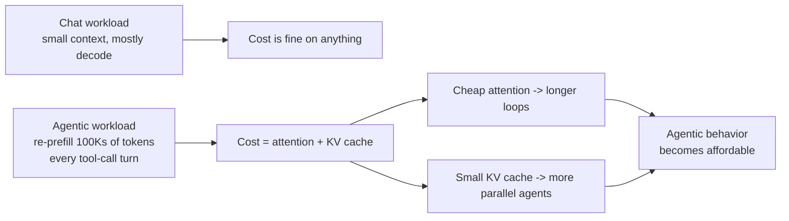
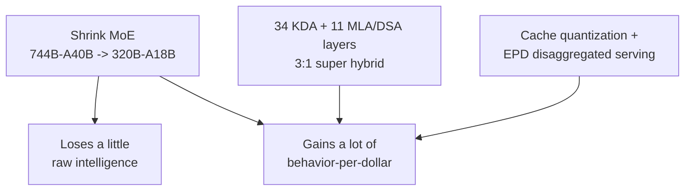

---
title: "Inference Engineering: The New Big Thing in AI"
publishedAt: "2026-09-01"
summary: "Raw intelligence and agentic behavior are different axes - and they have different leaders. How inference engineering turned a 320B/18B MoE into a model that out-executes Claude Opus on agentic benchmarks at 1/34th the cost."
author: "Yash Maheshwari"
image: "/blog/intelligence-vs-behavior-og.jpg"
---

We keep asking the wrong question about models. "Which one is smartest?" is a benchmark-leaderboard question, and it has a stable answer: whatever frontier lab shipped most recently.

The question that actually decides whether your agent ships is different: **which model behaves best inside a loop?** Not "how much does it know" but "can it run for forty tool-calling turns, keep the plan coherent, recover from a failed test run, and stop when the task is done."

Sebastian Raschka put this distinction on a slide better than I can:

On the intelligence axis: GPT-4.5-class and Gemini 3.1 Pro-class models. On the behavior axis: GLM-5.3-Flash. Twice. Same model competing with frontier intelligence on *agentic execution* - at $0.15 per million input tokens instead of $5-15.

That is not a model-quality miracle. It is an **inference engineering** story, and it is the story I want to tell here - because inference engineering is quietly becoming the discipline that separates teams who ship agents from teams who demo them.

## The Two Leaderboards That Matter

Look at Z.ai's release benchmarks for GLM-5.3-Flash against the heavyweights, and read them as two different leaderboards:

**Where it loses - raw intelligence:** HLE w/ Tools (55.3 vs GPT-5.6 Terra's 57.9), Agents' Last Exam (26.3 vs Gemini 3.7 Flash's 28.0), GDPval-AA behind GLM-5.2's own deeper-thinking numbers in absolute knowledge-density terms. Nobody should claim a 320B-A18B model out-reasons a frontier giant on pure reasoning. It does not, and that is fine.

**Where it wins - agentic behavior:** DeepSWE v1.1 at **63.4 vs Claude Opus 4.8's 58.0**. AutomationBench v1.0.6 at **48.8 vs Opus 4.8's 37.2** - a 31% relative gap over a model that costs roughly 34x more per token. Terminal Bench 2.1 at 84.3, within two points of the best frontier models.

Hold those two facts together: *loses on knowledge, wins on execution*. For a chat assistant that would be a weird trade. For an agent that edits code, runs tests, and operates tools all day, it is exactly the trade you want - because in a loop, execution quality compounds and raw knowledge mostly just sits in context.

## Why Agentic Workloads Are an Inference Problem

A chat message is mostly *decode* - emitting a few hundred tokens. Economically trivial. An agentic loop is mostly *prefill* - re-processing hundreds of thousands of context tokens on every tool-call turn, over and over, for 30-50 turns.

That flips which parts of the architecture matter:

Raw intelligence scales with parameters and training compute - the expensive axis. Agentic behavior scales with **how many loop-iterations you can afford per dollar**, which is an inference-engineering lever. That is the thesis: the labs that engineer inference best can buy behavior without buying intelligence.

## How You Engineer Behavior Instead of Scaling Intelligence

Sebastian Raschka's architecture notes on GLM-5.3-Flash are the best public teardown of this, and the details matter more than the marketing:

- **A 3:1 hybrid attention stack** - 34 Kimi Delta Attention (KDA) layers interleaved with 11 full-attention MLA / DeepSeek Sparse Attention layers. Here is the clever part: Kimi uses KDA *plus* full attention, and DeepSeek V3.2 uses DSA *plus* full attention. GLM-5.3-Flash combines **two efficient mechanisms** - a "super hybrid" where even its full-attention layers are compressed. That is where the reported 3x attention-compute and 4.4x KV-cache reductions come from.
- **A aggressively shrunk MoE** - from GLM-5.2's 744B total / 40B active parameters down to **320B total / 18B active**. Roughly 2.3x fewer total parameters and 2.2x fewer active per token. This is the intelligence budget being deliberately spent down.
- **A DeepSeek V4-style mHC residual path** with four parallel streams - training-stability engineering borrowed across labs, because stable hyperparameters let you retrain smaller models faster.
- A native vision encoder, so the agent can *see* rendered UIs and screenshots in its coding loop rather than only read text.

Now stack that against the workload math from the last section. The parameters you delete mostly hurt the knowledge/reasoning axis (HLE, GDPval) - the intelligence benchmarks where Flash concedes ground. The attention engineering mostly helps the loop axis: long contexts, many turns, high concurrency - the behavior benchmarks where it wins. **The architecture is shaped like the thesis.**

## What the Industry Should Copy (Regardless of Vendor)

I want to be careful not to turn this into a Z.ai ad, so let us extract the transferable engineering:

1. **Disaggregate prefill from decode.** Z.ai's Encode-Prefill-Decode (EPD) architecture runs encoding, prefill, and decoding as independently scalable worker pools. Agentic traffic has wildly swinging prefill-to-decode ratios turn to turn; monolithic serving leaves hardware idle. Every serious serving stack (vLLM, SGLang, TensorRT-LLM) is converging on this.
2. **Quantize the cache, not just the weights.** Hybrid INT8/FP8/BF16 KV-cache quantization cut Flash's cache footprint 4.44x vs GLM-5.3. Cache memory is the binding constraint on how many concurrent agent loops you can serve.
3. **Let models help build their own serving layer.** Z.ai used a GLM-5.3-powered agent to write kernels and find bottlenecks, reporting a 3x serving improvement - including serving on domestic Chinese chips at NVIDIA-parity per-token cost. Whatever hardware you have, an agent-in-the-loop optimization cycle is now a proven technique.
4. **Price follows engineering, not just scale.** Flash launched at a limited-time 50% discount ($0.15/$0.50 per MTok; list is around double that). Even at list price it is ~10x under Opus 4.6 - because the architecture, not subsidies, moved the cost curve.

## The Honest Trade-offs

To keep this credible: Flash is not uniformly better. It gives up ground on pure reasoning and knowledge benchmarks (HLE, Agents Last Exam). Its pricing is promotional and will rise. It is a young model with less ecosystem hardening than Claude in agentic tooling. And release-time vendor benchmarks deserve the same skepticism you would apply to any vendor - which is exactly why the next section matters.

A cheap model is only a win if it is *good enough for your task*, and the only way to know is measurement. Benchmark scores are the vendor claim; your eval set is your claim. This is the core of my post on [LLM evaluation](/blog/llm-evals), applied here with one twist: **evaluate behavior, not intelligence.** Task completion rate over 40 turns, tool-call accuracy, cost per *completed* task, tokens per task - not MMLU-style scores. A model that finishes in 30% fewer tokens is 30% cheaper on top of the sticker discount.

## The Playbook

1. **Route, do not marry.** Default the bulk of agent steps to the cost-efficient tier; escalate the hardest 5% of reasoning to a frontier model. The bill barely notices the escalation.
2. **Evaluate on loop metrics** - completion rate, tool accuracy, tokens-per-task - before swapping any model in production.
3. **Design for cache hits** - stable system prompts and prefix-stable context are priced 5-10x cheaper everywhere.
4. **Treat serving as a product surface** - disaggregated prefill/decode and cache quantization are where the cost curves are actually moving.

The intelligence leaderboard will keep being won by whoever trains next. But the behavior leaderboard - the one that decides what agents you can afford to run - is being won by inference engineering. GLM-5.3-Flash matching frontier models twice on that axis at $0.15 per million tokens is the clearest evidence yet that the next big thing in AI is not a bigger model. It is a better loop.
