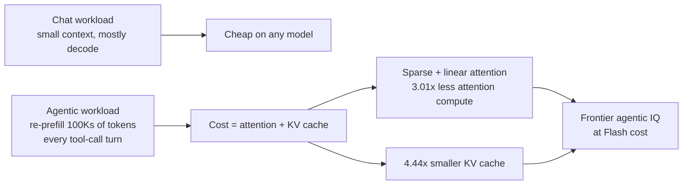
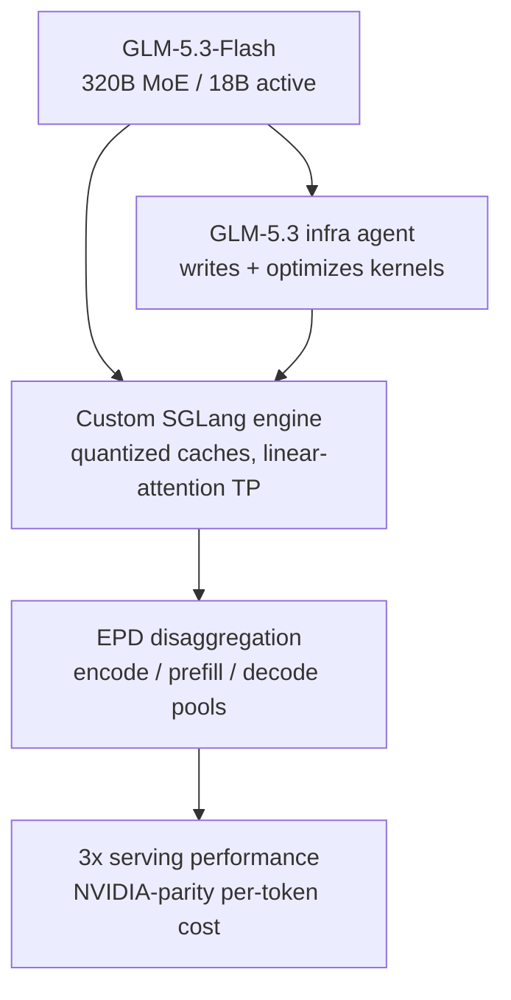

---
title: "Inference Engineering: The New Big Thing in AI"
publishedAt: "2026-09-01"
summary: "Everyone optimizes prompts; almost nobody optimizes inference. How GLM-5.3-Flash matches frontier agentic intelligence at ~1/14th to 1/34th the cost - and why the model serving layer is now a competitive weapon."
author: "Yash Maheshwari"
image: "/blog/inference-cost.svg"
---

Every team I talk to is optimizing the wrong layer. They obsess over prompts, RAG chunk sizes, and which agent framework to use - while their monthly invoice quietly decides which products get to exist.

Here is the uncomfortable math. A typical agentic coding task - the kind where an agent reads a repo, plans, edits files, runs tests, and iterates - burns somewhere around **400K input tokens and 8K output tokens**. Long-horizon tasks are worse; agentic loops re-send the whole conversation every step. Let us price that single task against current API list prices:

| Model | Input / Output (per MTok) | Cost for one task |
|---|---|---|
| Claude Opus 4.6 | $5.00 / $25.00 | **~$2.20** |
| Claude Sonnet 5 | $2.00 / $10.00 | **~$0.88** |
| GLM-5.3 | $1.40 / $4.40 | **~$0.60** |
| GLM-5.3-Flash | $0.15 / $0.50 | **~$0.064** |

Read that bottom row again. **34x cheaper than Opus. 14x cheaper than Sonnet 5.** At 10,000 tasks a day, you are choosing between a $220K/month line item and a $640/month one. That is not an incremental improvement - that is the difference between a demo and a business.

This is why I think **inference engineering** is the actual story of 2026. Not "which model is smartest," but *who can deliver frontier-grade agentic intelligence at a per-token cost that survives contact with production*. And GLM-5.3-Flash from Z.ai is the most aggressive answer to that question so far.

## What Inference Engineering Actually Means

"Inference engineering" is the discipline of treating the serving path - architecture, memory, scheduling, hardware - as a first-class product surface, not an afterthought behind model quality. The reason it suddenly matters: agents changed the shape of inference workloads.

A chat message is mostly *decode* - generating a few hundred tokens. Cheap. An agentic loop is mostly *prefill* - re-processing hundreds of thousands of context tokens on every turn, plus tool-call round trips. Under that workload, your cost is not dominated by "how good the model is." It is dominated by **attention over long context and KV cache memory**. Those are exactly the two levers GLM-5.3-Flash was engineered around.

## The Architecture: Getting Smarter With Less Compute

The headline spec of GLM-5.3-Flash is unusual: **320B total parameters with only 18B activated** - a sparse Mixture-of-Experts design where most parameters sit idle on any given token. But the genuinely interesting part is that it is the first open-source frontier model to combine **sparse and linear attention**:

- **3.01x reduction in attention computation** vs the GLM-5.3 flagship
- **4.44x reduction in KV cache memory** - the resource that usually makes million-token contexts prohibitively expensive to serve
- A **1M-token context window** and 128K max output, natively multimodal (text, image, video, file)

The reason this matters for agents specifically: KV cache size scales with context length. Shrink your cache footprint and you can serve far more concurrent long-context sessions on the same hardware - or cut the per-token cost proportionally. Linear attention makes million-token prefill economically survivable, which is what turns "agentic tasks with whole repos in context" from a research demo into a $0.06 operation.

And despite all the compute being stripped out, Z.ai reports GLM-5.3-Flash is **stronger than GLM-5.2**, the previous generation flagship - it is not a crippled "mini" variant. The family lineage backs this up: GLM-4.6 already matched Claude Sonnet 4-class models on eight standard benchmarks and beat it across 74 real-world Claude Code coding tests (with trajectories published for verification), while consuming ~30% fewer tokens than its predecessor.

## Case Study: The Serving Stack as a Moat

Here is the block that convinced me inference engineering is the real story. Z.ai served GLM-5.3-Flash at scale on **Chinese AI chips** - hardware with far less memory and bandwidth than mainstream NVIDIA GPUs - and reached per-token economics *comparable to NVIDIA hardware*. How:

1. **A custom inference engine on SGLang** - not a generic runtime, but one co-designed with the model: W8A8 quantization, hybrid INT8/FP8/BF16 cache quantization, tensor parallelism for the linear attention layers.
2. **Encode-Prefill-Decode (EPD) disaggregation** - multimodal encoding, prompt prefill, and token decoding run as *independently scalable worker pools*. In an agentic workload where prefill-to-decode ratios swing wildly turn to turn, this is the difference between 30% and 90% hardware utilization.
3. **The model optimized its own serving stack.** A GLM-5.3-powered infrastructure agent helped engineers write kernels, find performance bottlenecks, and tune the serving layer - a feedback loop where the model improved the system serving it. Result: **3x end-to-end serving performance** vs their initial baseline.

The takeaway is not about chips. It is that **the winning teams now co-design model, engine, and hardware**. If your competitor treats inference as a systems problem and you treat it as an API call, you lose on cost per task - and cost per task is the scoreboard.

## Where Evals Fit (Do Not Skip This)

A cheaper model is only a win if it is *actually good enough for your task* - and the only way to know is measurement. This is the point where I would plug the framework from my post on [LLM evaluation](/blog/llm-evals): benchmark scores are the vendor claim, but your eval set is your claim. Three notes specific to cheap-model migration:

- **Benchmark on agentic loops, not chat.** GLM-5.3 sets open-source SOTA on Terminal Bench 3.0 and Agents Last Exam (CLI); GLM-4.6 CC-Bench wins were measured in a *real* Claude Code environment with published trajectories. Static Q&A accuracy tells you nothing about a 40-turn tool-calling loop.
- **Token efficiency is a benchmark.** A model that finishes the task in 30% fewer tokens is 30% cheaper *on top of* the per-token discount. Vendors now publish this - track it in your evals.
- **A/B in production before migrating.** Route 10% of traffic, then compare task completion rate and cost per completed task - not per task attempted.

The evaluation habit costs a week. The wrong-model migration costs a quarter.

## The Playbook

If I were starting an agentic product today:

1. **Default to the cost-efficient tier** (GLM-5.3-Flash class) for the bulk of agent steps - planning, tool orchestration, summarization.
2. **Escalate selectively** to frontier models for the hardest reasoning steps. A router that sends 5% of traffic to Opus while Flash handles the rest barely moves the bill.
3. **Design prompts for cache hits** - every provider prices cached input at 5-10x less; stable system prompts and prefix-stable context are free money.
4. **Build the eval harness first** (unit checks, LLM-as-judge, A/B) so swapping models is a measurement decision, not a vibe.
5. **Watch inference engineering as a discipline** - EPD disaggregation, KV-cache quantization, and linear attention are moving cost curves faster than model quality is moving.

The frontier-model monopoly on *intelligence* ended a while ago. 2026 is the year the monopoly on *serving that intelligence cheaply* ends too - and the teams that learn to treat inference as engineering, not procurement, will ship agents the others cannot afford to run.
