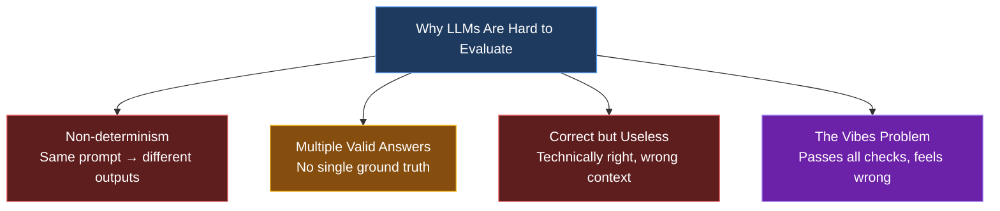
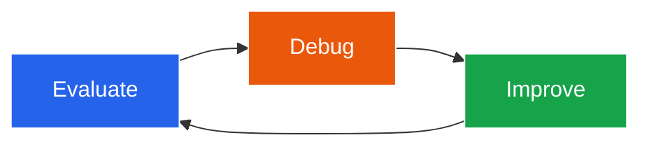
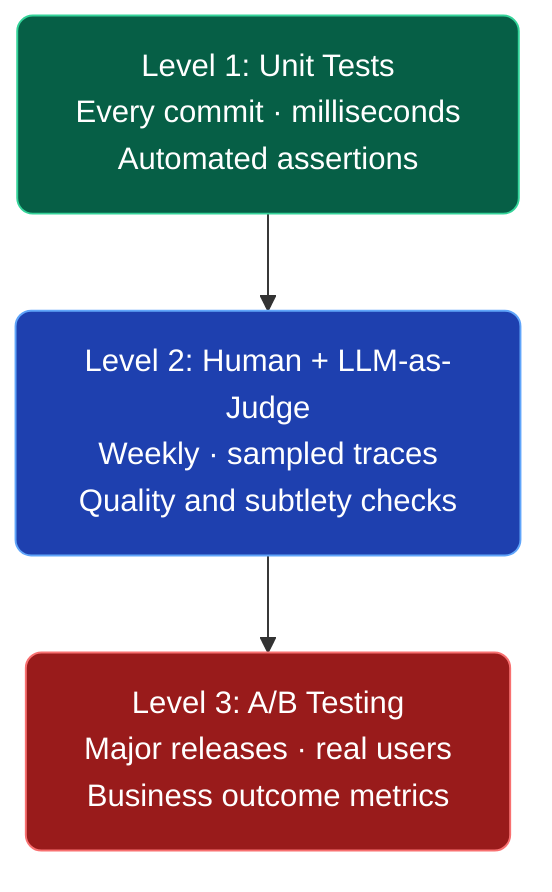
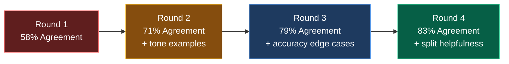
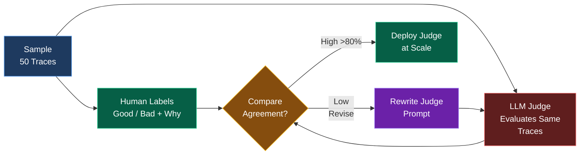
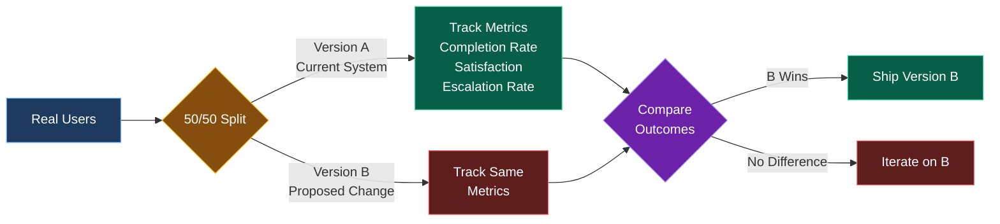
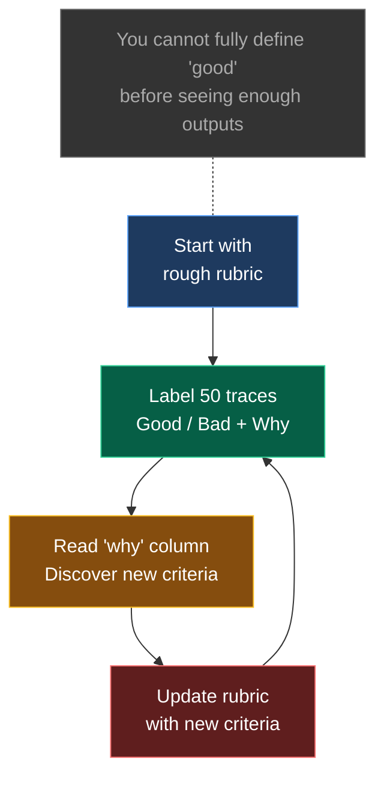

You've built something cool. A RAG pipeline, a support bot, a document analyzer. It works perfectly in your test cases. You demo it to your team and it's smooth. You ship it.

Then real users show up. One weird message trips it up. You patch the prompt. Something else breaks. You patch that. The system prompt balloons to 3,000 tokens and you're not entirely sure what's load-bearing anymore. You switch from GPT-4o to Claude to Gemini hoping the new model just fixes it. Sometimes it helps. Mostly it shifts where the failures happen.

A few weeks in, you're playing whack-a-mole with edge cases, the prompt has become a wall of special instructions, and you genuinely can't tell if version 14 is better than version 8.

This isn't a model problem. It's a measurement problem. You can't systematically improve something you can't systematically evaluate. This post is about fixing that — not with a fancy observability platform or a PhD in NLP, but with a practical framework you can start using this week. We'll go from "how do I even know if this is working" to a real eval system in three levels.

## A Concrete Example

To make this less abstract, let's use a running example throughout: an AI customer support agent for a SaaS product. Users ask questions, the agent retrieves relevant docs via RAG, and responds. The kinds of failures you'd see include returning the right answer but for the wrong product tier, hallucinating a feature that doesn't exist, answering a billing question with technical documentation, giving a correct answer in a tone that reads as dismissive, or formatting a response as a bullet list when the user asked a yes/no question. Some of these are checkable with code. Some require human judgment. Some you won't even notice until you've read 200 traces.

## Why LLMs Are Uniquely Hard to Evaluate

With traditional software, wrong is wrong. A function that returns null when it should return 42 fails deterministically, every time. You write a unit test, it catches regressions, life is good. The definition of correct is unambiguous and encodable. LLMs don't work like that.

**Non-determinism.** The same prompt, same model, same temperature can return meaningfully different outputs on consecutive calls. What passed your manual check yesterday might fail it tomorrow.

**Multiple valid answers.** For most tasks, there isn't one correct response — there's a space of acceptable ones. "Summarize this document" has hundreds of valid outputs and no ground truth to compare against.

**Correct but useless.** A response can be factually accurate, grammatically perfect, and completely miss what the user needed. It answered the question asked rather than the question meant.

**The vibes problem.** A response can pass every objective check and still just feel wrong. Wrong tone, wrong register, too formal, too casual, technically correct but weirdly cold.

## The Loop Most People Skip

When something breaks in an AI system, the instinct is to fix it directly. Tweak the prompt. Try a different model. Add more context to the RAG chunk. This is the "Change Behavior" step, and it's where almost everyone spends 90% of their time. The problem: behavior change without measurement is just guessing.

Hamel Husain puts this directly: unsuccessful AI products almost always share a single root cause — a failure to build evaluation systems. Most teams focus exclusively on improving behavior, which is exactly why their products never get past demo quality.

The real improvement loop: Evaluate → Debug → Improve → repeat. Evaluation is what makes the other two steps meaningful. Without it, you're not running a loop — you're just making changes and hoping.

## The Three Levels of Evals

Think of evaluation as a pyramid. The bottom is cheap, fast, and runs constantly. The top is expensive, slow, and used rarely. You build from the bottom up.

### Level 1 — Unit Tests

Unit tests for LLMs are fast, automated assertions. Same concept as pytest — you define what a correct output looks like, and the test checks whether the model output satisfies that definition. They run on every code change, take milliseconds, and catch regressions before they reach users.

Key differences from regular unit tests: you don't need 100% pass rate (it's a product decision), they're reusable beyond testing (same assertions can be used inline during inference for retry logic), and LLMs can help you write them.

For a customer support agent, you might write tests like: structural checks that the category is one of "billing", "technical", or "general"; semantic checks that billing questions actually get classified as billing; format compliance that yes/no questions don't return bullet lists; and hallucination checks that the model doesn't claim features your product doesn't have. Every production failure you discover becomes a new test. Your test suite grows with your understanding of where the system fails.

### Level 2 — Human Review + LLM-as-Judge

Unit tests cover what you can express as code. Level 2 covers everything else — quality, tone, helpfulness, subtlety, and the failure modes you haven't thought of yet. This level has three components: logging your traces, actually looking at your data, and automating with LLM-as-Judge.

First, log your traces. A trace is a complete record of a single model interaction — the input, retrieved context, intermediate steps, and the final output. If you're using LangChain, LangSmith logs traces automatically. If not, a simple database table with input, context, output, timestamp, and session_id is enough to start.

Second, actually look at your data. This is the step most people skip. You cannot outsource data inspection. Remove every friction barrier between you and your traces. What you're looking for: failure modes you've never seen before, patterns in how the model fails, cases that pass unit tests but feel wrong, and surprisingly good outputs worth saving as positive examples.

Third, LLM-as-Judge. You write a judge prompt that instructs a more capable model to evaluate your system's outputs on specific dimensions. It returns a rating and a written critique. For a support agent, you might evaluate accuracy (does it avoid hallucination?), helpfulness (does it solve the user's problem?), and tone (is it professional without being sycophantic?).

The critical insight: an unvalidated LLM judge is just a model confidently critiquing itself. Before you trust it, you need to check whether it agrees with actual human judgment. The workflow: sample 50 traces, run your judge on all of them, have a human label the same examples, measure agreement, and revise until agreement is high enough.

Start with binary labels (good/bad), not scores. "Helpfulness: 4.2/5" is almost impossible to act on. "Bad — gave accurate information but didn't tell the user what to do next" tells you exactly what to fix. Track agreement rates across rounds: an initial judge prompt might get 58% agreement, but after adding examples of what failure looks like for tone, that climbs to 71%. Clarifying accuracy definitions for edge cases gets you to 79%. Splitting helpfulness into separate criteria gets you to 83%.

### Level 3 — A/B Testing

This level is for mature products only. A/B testing for LLM systems means running controlled experiments with real users — half get version A, half get version B, and you measure which produces better outcomes on metrics you care about. Task completion rate, follow-up question rate, user satisfaction, escalation rate — these are the signals that matter.

## The Criteria Drift Problem

Here's a finding from the research that changes how you should think about building eval systems. The intuitive approach is to define your evaluation criteria upfront, build a rubric, then measure outputs against it. Clear, systematic, clean. The problem is that this doesn't match how evaluation actually works in practice.

Shreya Shankar at UC Berkeley ran a study that found a catch-22 they named criteria drift: you can't fully specify what "good" means before you've seen enough model outputs to develop intuitions about what good looks like. Some evaluation criteria are output-dependent. They don't exist in the abstract; they only become visible when you're looking at real examples.

The practical implications: don't try to design a perfect rubric on day one. Start with a rough sense of what good looks like (accurate, helpful, appropriate tone) and label examples with that rough rubric. Your rubric will get more specific as you see more data. Your "why" column is your rubric — every time you label something as bad, write down why. After 50 examples, read all the entries and you'll see your real rubric emerge — the one that emerged from actual outputs rather than abstract principles.

Expect your judge prompt to need many revisions. The first version will miss things the fifth version catches. Each round of human-judge comparison will surface new criteria you didn't think to include. This is normal and expected. Be skeptical of tools that ask you to define all criteria upfront. If an eval platform's workflow is "define rubric, automate evaluation, done," it's assuming your criteria are stable and complete from the start. They aren't. The definition and the measurement are entangled processes, not sequential ones.

## What Good LLM-as-Judge Prompts Look Like

The quality of your judge prompt determines whether your eval system is useful or noise. Be specific about failure modes, not just success criteria. Instead of "responses should be accurate", write "responses FAIL on accuracy if they reference features the product doesn't have, cite incorrect pricing, or make definitive statements about account state without qualifying that the user should verify."

Ask for critique before verdict — having the judge write out its reasoning before assigning pass/fail dramatically improves consistency. Evaluate one dimension at a time rather than asking about accuracy, helpfulness, and tone simultaneously. Use concrete examples of what passing and failing look like. Include the full context — the judge should see everything the model saw, including the retrieved context and system prompt version. A response that's appropriate given certain context might be wrong given different context. Without the full trace, the judge can't tell.

## Common Mistakes

**Buying tools before looking at data.** LangSmith, Weave, Braintrust, Arize — these are all genuinely useful. But they can't tell you what failure modes look like in your system. That requires human eyes on real examples. If you haven't manually reviewed 50 traces, you're not ready for an observability platform. You don't know what to look for yet.

**Generic metrics nobody acts on.** If your weekly eval report shows "helpfulness: 4.2, accuracy: 4.5" — what do you do with that? The useful metric points to a specific, fixable problem. "Billing questions resolved on first response: 62%" is actionable. "Helpfulness: 4.2" is not.

**Unvalidated LLM judges.** If you haven't checked whether your judge agrees with human judgment on a sample of examples, you don't have an eval system — you have a model confidently critiquing itself. The number it produces is not a quality signal until it's been validated.

**One-and-done rubric design.** Writing a judge prompt once and never updating it. Your system changes, your users change, the failure modes change. Your eval criteria should evolve with the product. Expect to revise your judge prompt every few weeks, especially early on.

**Waiting for production data to start.** You can generate synthetic test cases right now. A prompt like "generate 40 different ways a user might ask about billing, including confused, angry, and edge case inputs" gets you a real test suite before a single user has touched your product.

**Optimizing for eval, not for users.** Once you have an automated judge, there's a temptation to optimize prompts to score well on the judge rather than to actually help users. The antidote is periodic human review — never fully stopping the manual trace inspection even after you've automated most of it.

## Where to Start Tomorrow

You don't need a framework. You need a starting point.

**This week:** pick your worst-known failure mode — the thing that breaks most often, or that you're most nervous about. Write 3 unit test assertions around it: a structural check, a semantic check, and a format check. Log 50 traces — real usage if you have it, synthetic if you don't. Label them good or bad in a spreadsheet and add a "why" column for every bad label.

**Next week:** read your "why" column and write a judge prompt based on what you found. Run the judge on the same 50 examples and measure agreement with your labels. Revise the judge prompt for every disagreement. Add 3 more unit tests based on the failure modes you discovered in the traces.

That's a real eval system. It will feel underwhelming relative to the problem it solves. The value compounds. Every failure mode becomes a unit test. Every round of human labeling improves your judge. Every metric you add gives you more signal when you make a change. Three months from now, you'll be able to say "version 14 is 18% better than version 8 on billing question resolution rate" instead of "version 14 feels better, I think." The teams shipping reliable AI products aren't using better models than everyone else. They're running this loop faster. That's the whole game.

## Further Reading

- Your AI Product Needs Evals by Hamel Husain — the Rechat case study this post draws heavily from, with real screenshots from their eval tooling
- Task-Specific LLM Evals that Do and Don't Work by Eugene Yan — a deep survey of eval techniques across summarization, classification, extraction, and RAG tasks
- Who Validates the Validators? by Shankar et al. (UIST 2024) — the criteria drift paper, the most cited paper at the conference that year
- LLM-as-a-Judge: A Complete Guide by Evidently AI — a practical guide to writing, validating, and maintaining judge systems

These resources cover the landscape from practical implementation to academic research. The Hamel Husain post is the best starting point for most teams — it's grounded in real production experience at Rechat. The Shankar paper changes how you think about rubric design. The Evidently AI guide is your reference for writing and validating judge prompts in practice.

If you're building something with LLMs and want to talk evals, RAG, or agentic systems, find me on Twitter or check out my other posts.
