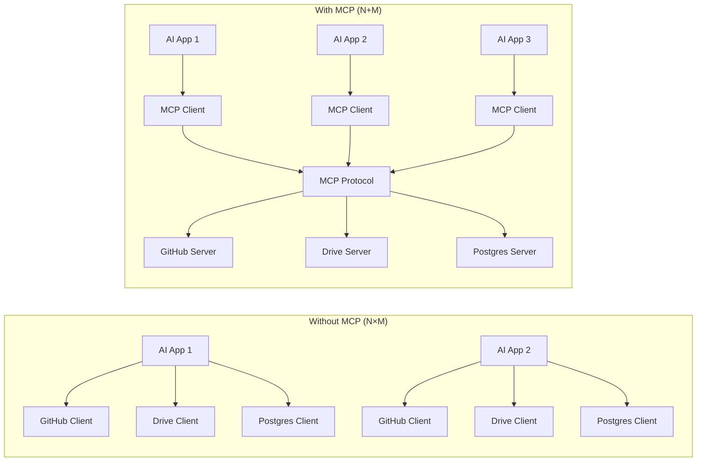
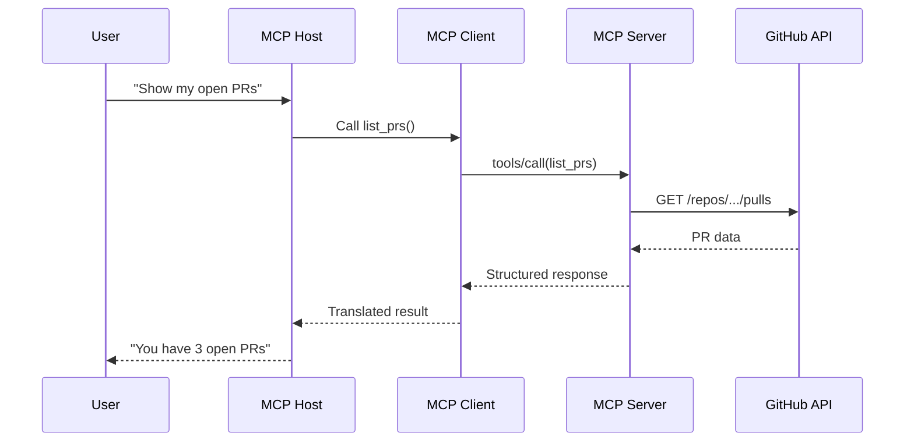

# Model Context Protocol (MCP): The Universal Bridge for AI Applications

Discover how the Model Context Protocol (MCP) simplifies AI integrations. Learn why N×M integration problems become N+M solutions, and how to implement MCP in your AI applications.

## The Integration Nightmare

You build an AI chatbot. You want it to read files from Google Drive, query your PostgreSQL database, search the web, send Slack messages, and access GitHub repos.

So you write custom code for each one. Five different APIs. Five different authentication flows. Five different error handling patterns. Five maintenance headaches.

This is the N×M problem.

## MCP 101

MCP is an open protocol that standardizes how AI applications connect to external systems. It gives the ecosystem a shared language for tools, resources, and prompts.

Think of it as the USB-C of AI integrations: one standardized connector instead of dozens of proprietary cables.

What MCP actually is:

- A communication protocol
- A standard for capability discovery
- A session lifecycle specification
- A JSON-RPC based message format

What MCP is not:

- A framework or library
- An LLM reasoning system
- A prompt engineering tool
- A UI or workflow manager

## The N×M → N+M Solution

Write each MCP server once. Every MCP-compatible client can use it. N applications + M servers = N+M implementations.

## Architecture: Three Layers

MCP follows a strict three-layer architecture.

### 1. Host

The AI application your users interact with.

Examples:

- Claude Desktop
- VS Code with MCP extension
- Cursor IDE
- Your custom AI chatbot

### 2. Client

The mandatory intermediary. Hosts never talk directly to servers.

Clients speak the MCP protocol, convert host requests into JSON-RPC messages, and convert responses back into host-usable data.

### 3. Server

The program that exposes capabilities and does actual work.

Servers advertise tools, resources, and prompts. They handle the domain-specific work: GitHub API, filesystem access, database queries, and more.

## How They Work Together

## Protocol Lifecycle

MCP sessions follow a strict lifecycle.

### Phase 1: Initialization

The client sends an initialize request, the server returns its capabilities, and the connection becomes ready.

### Phase 2: Operation

The host can now discover tools and call them through the client.

### Phase 3: Shutdown

The session closes cleanly and resources are released.

## Why MCP Matters

MCP turns integrations from a one-off engineering tax into a reusable protocol layer. The result is cleaner architecture, better portability, and dramatically less duplicated work.

If you are building AI software that talks to other software, MCP is the abstraction worth learning.
