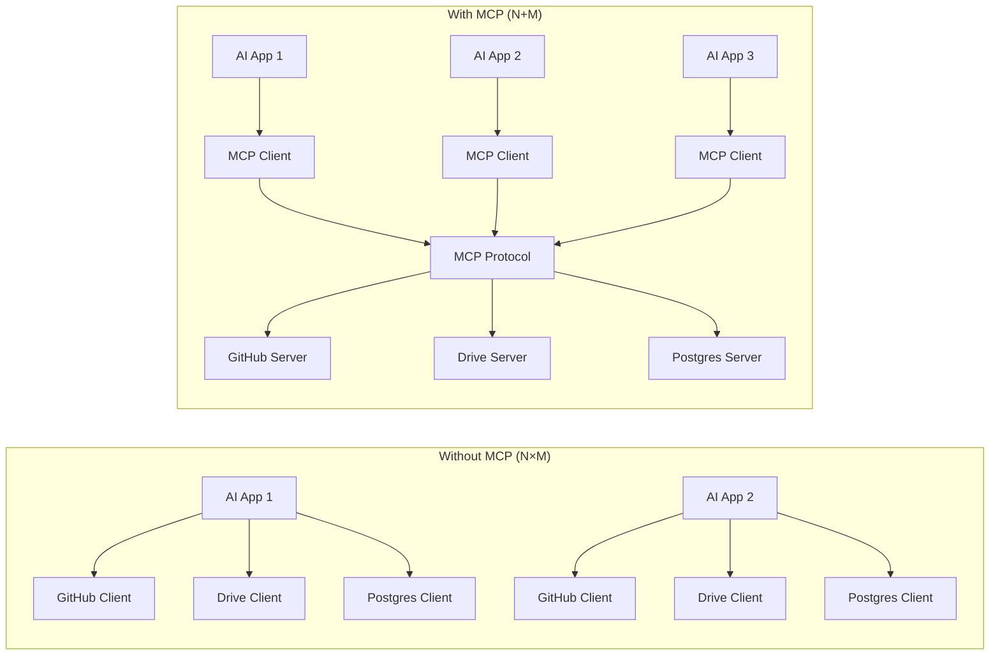
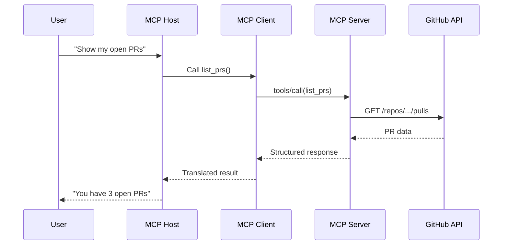

# Model Context Protocol (MCP): The Universal Bridge for AI Applications


Discover how the Model Context Protocol (MCP) simplifies AI integrations. Learn why N×M integration problems become N+M solutions, and how to implement MCP in your AI applications.

## The Integration Nightmare

You build an AI chatbot. You want it to read files from Google Drive, query your PostgreSQL database, search the web, send Slack messages, and access GitHub repos.

So you write custom code for each one. Five different APIs. Five different authentication flows. Five different error handling patterns. Five maintenance headaches. Now multiply that by every AI application you build. Another AI app means starting over with the same integrations.

This is the N×M problem. Each AI application (N) needs custom code for each external system (M), giving you N×M implementations to build and maintain. For 5 apps connecting to 5 services, that's 25 separate integrations. It doesn't scale, it's fragile, and every API change means updating every single client.

## MCP 101

MCP is an open protocol that standardizes how AI applications connect to external systems. It gives the ecosystem a shared language for tools, resources, and prompts. Think of it as the USB-C of AI integrations: one standardized connector instead of dozens of proprietary cables.

Anthropic originally designed MCP for Claude, but it's an open standard. Any AI application can implement an MCP client, and any service can implement an MCP server. They speak the same protocol, regardless of which LLM or framework is running underneath.

What MCP actually is:

- **A communication protocol** — defines how AI apps and services exchange messages
- **A standard for capability discovery** — servers advertise what they can do, clients discover it dynamically
- **A session lifecycle specification** — defines initialization, operation, and shutdown phases
- **A JSON-RPC based message format** — lightweight, language-agnostic request/response pattern

What MCP is not:

- **A framework or library** — it's a protocol, not a code framework you build into your app
- **An LLM reasoning system** — doesn't handle chain-of-thought, planning, or agent logic
- **A prompt engineering tool** — doesn't manage prompts or system instructions
- **A UI or workflow manager** — doesn't provide dashboards, visual builders, or orchestration

The distinction matters because teams often mistake MCP for an agent framework or a drop-in replacement for LangChain/LlamaIndex. It's simpler than that and more powerful because of it. MCP handles the communication layer so your AI applications can focus on reasoning and user experience.

## The N×M → N+M Solution



Write each MCP server once. Every MCP-compatible client can use it. Your AI chatbot, VS Code extension, Claude Desktop app, and custom tool can all talk to the same GitHub MCP server. N applications + M servers = N+M implementations instead of N×M. For 5 apps connecting to 5 services, that's 10 implementations instead of 25. The savings compound as you add more applications or services because each new app instantly gets access to every existing MCP server, and each new server is immediately available to every existing MCP client.

## Architecture: Three Layers

MCP follows a strict three-layer architecture. Understanding this is critical because it dictates how every MCP interaction works.

### 1. Host

The AI application your users interact with. This is the top level where the LLM runs and where user-facing features live.

Examples:

- Claude Desktop
- VS Code with MCP extension
- Cursor IDE
- Your custom AI chatbot

**What hosts do:** Display UI to users, run the LLM, manage multiple MCP clients, orchestrate which tools to use, and format responses back to users.

```python
# Conceptual MCP Host
class MCPHost:
    def __init__(self):
        self.clients = []
        self.llm = ClaudeModel()

    def handle_user_message(self, message):
        tools_needed = self.llm.analyze(message)
        for tool in tools_needed:
            client = self.find_client_for_tool(tool)
            result = client.call_tool(tool.name, tool.args)
        return self.llm.format_response(results)
```

### 2. Client

The mandatory intermediary. This is crucial: **hosts never talk directly to servers**. One client per server. If your host uses three servers, it creates three clients.

**Why this matters:** Fault isolation (server crash doesn't affect other connections), security boundaries (each client-server pair has isolated permissions), parallel execution (independent request handling per server), and state encapsulation (no shared state, no cross-tool interference).

**What clients do:** Speak the MCP protocol, convert host requests into MCP JSON-RPC messages, convert MCP responses back into host-usable data, manage connection lifecycle, and handle capability negotiation.

```python
class MCPClient:
    def __init__(self, server_connection):
        self.connection = server_connection
        self.capabilities = None
        self.tools = []

    async def initialize(self):
        response = await self.send_initialize()
        self.capabilities = response["capabilities"]
        self.tools = await self.discover_tools()

    async def call_tool(self, name, arguments):
        request = {
            "jsonrpc": "2.0",
            "method": "tools/call",
            "params": {"name": name, "arguments": arguments}
        }
        return await self.send(request)
```

### 3. Server

The program that exposes capabilities and does actual work. Each server handles one domain — GitHub, files, databases, etc.

**What servers do:** Advertise capabilities (tools, resources, prompts), execute tool requests, access data (local files, remote APIs, databases), and return structured responses.

**Example servers:** filesystem-server for read/write local files, github-server for GitHub API access, postgres-server for database queries.

```python
from mcp.server import Server

server = Server("my-server")

@server.list_tools()
async def list_tools():
    return [
        {
            "name": "add_expense",
            "inputSchema": {
                "type": "object",
                "properties": {
                    "amount": {"type": "number"},
                    "category": {"type": "string"}
                }
            }
        }
    ]

@server.call_tool()
async def call_tool(name, arguments):
    if name == "add_expense":
        db.insert(arguments)
        return {"success": True}
```

### How They Work Together



The flow in plain terms: user asks Claude Desktop to show their open PRs, the host runs the LLM which identifies the GitHub tool, the host tells the MCP client to call list_prs, the client converts this to MCP protocol format as a JSON-RPC request, the server receives the request and calls the GitHub API, GitHub returns PR data, the server wraps it in a structured MCP response, the client translates it back to host format, and the LLM generates natural language output for the user. Every MCP interaction follows this same pattern — the protocol layer between client and server handles all the standardization, while the host and server focus on their respective jobs.

## How They Work Together


## Protocol Lifecycle

MCP sessions follow a strict three-phase lifecycle. Understanding this prevents debugging hell later.

### Phase 1: Initialization (The Handshake)

**Hard rule:** No tool or resource calls allowed before initialization completes. The client sends an initialize request with its protocol version and capabilities. The server responds with its own capabilities and server info. Once the client sends an `initialized` notification, the session is live.

```json
{"jsonrpc": "2.0", "method": "initialize", "params": {
    "protocolVersion": "2024-11-05",
    "capabilities": {"tools": {"listChanged": true}},
    "clientInfo": {"name": "my-client", "version": "1.0.0"}
}}
```

What's negotiated: protocol version (both must agree), capabilities (what each side supports), and implementation metadata. After the initialize response, the client sends an `initialized` notification to confirm the session is ready.

```
Client → Server: initialize request
Server → Client: capabilities + server info
Client → Server: initialized notification
✅ Session established
```

### Phase 2: Operation

The host can now discover tools and call them through the client. This is where actual work happens. The client sends `tools/list` to discover available tools, then `tools/call` with the tool name and arguments to execute specific ones. Resources can be accessed via `resources/read` for read-only data access.

```json
// Tool discovery
{"method": "tools/list"}

// Tool execution
{"method": "tools/call", "params": {"name": "add_expense", "arguments": {"amount": 42.50, "category": "food"}}}

// Resource access
{"method": "resources/read", "params": {"uri": "file:///expenses/january.json"}}
```

Each tool call returns structured content with type, text, and optional metadata. Resources follow a similar pattern via `resources/read` but are read-only and cacheable. The key difference: tools are for actions that modify state, resources are for retrieving data without side effects.

**Important rule:** Resources can be cached aggressively by the LLM. Tools must be called fresh each time because they may have side effects. MCP servers advertise both capabilities, and the client decides which to use based on what the LLM needs at each step.

### Phase 3: Shutdown

The session ends when either side terminates. Connection closes cleanly and resources are released. To use the server again, full initialization is required.

## Tools vs Resources: Critical Distinction

MCP defines two types of capabilities with different semantics. Choosing the right one matters for correctness and performance.

| Aspect | Tool | Resource |
|---|---|---|
| Side effects | Yes (modifies state) | No (read-only) |
| Invocation | Active (explicit call) | Passive (data retrieval) |
| Use case | Actions | Context/Information |
| Caching | Unsafe | Safe |
| Idempotency | Often not idempotent | Idempotent |

**Tool example (side effects):**

```python
@server.tool()
async def send_slack_message(channel: str, text: str):
    slack_client.post_message(channel, text)
    return {"sent": True}
```

This modifies state by sending a message. Must be called fresh each time, result should not be cached.

**Resource example (read-only):**

```python
@server.resource("file:///{path}")
async def read_file(path: str):
    content = filesystem.read(path)
    return {"uri": f"file:///{path}", "mimeType": "text/plain", "text": content}
```

No side effects — just returns data. LLMs can cache resource responses aggressively.

**Why this matters:** Resources enable efficient context loading — the LLM can pull in large amounts of reference data without worrying about stale caches. Tools enable AI to take real actions in the world. MCP servers advertise both, and the client decides which to use based on what the LLM needs at each step. Using a tool when a resource would suffice means wasted latency and potential side effects. Using a resource when a tool is needed means stale or incorrect data.

## Transport Layer: How Data Moves

Transport is orthogonal to MCP protocol semantics. Same protocol, different delivery mechanisms:

- **STDIO Transport** — standard input/output pipes between processes. Ultra-low latency (<1ms), maximum security (local-only). Best for local development and desktop applications. Configured via `claude_desktop_config.json` with command and args. The parent process (Claude Desktop) spawns your server as a child process and communicates through stdin/stdout pipes.

```json
{
  "mcpServers": {
    "my-server": {
      "command": "python",
      "args": ["/path/to/server.py"]
    }
  }
}
```
- **HTTP + SSE Transport** — HTTP for requests, Server-Sent Events for streaming responses. Best for remote/cloud servers and team collaboration. Network latency 20-100ms. Requires a hosted server but enables remote access and real-time streaming. Uses Starlette or FastAPI to serve the SSE endpoint.

```python
from mcp.server.sse import SseServerTransport
from starlette.applications import Starlette

app = Starlette()
sse = SseServerTransport("/messages")

@app.route("/sse")
async def handle_sse(request):
    async with sse.connect_sse(request.scope, request.receive, request._send) as streams:
        await server.run(streams[0], streams[1], init_options)
```
- **Streamable HTTP Transport** — designed for serverless platforms like Vercel, Cloudflare Workers, and AWS Lambda. Auto-scaling with cold start latency 50-200ms. Perfect for production APIs where you don't want to manage a long-running server.

```typescript
import { Server } from "@modelcontextprotocol/sdk/server";
import { StreamableHTTPTransport } from "@modelcontextprotocol/sdk/server/http";

export const config = { runtime: "edge" };
const server = new Server({ name: "serverless-mcp", version: "1.0.0" });

export default async function handler(req: Request) {
  const transport = new StreamableHTTPTransport();
  return transport.handleRequest(req, server);
}
```

| Feature | STDIO | HTTP+SSE | Streamable HTTP |
|---|---|---|---|
| Latency | <1ms | 20-100ms | 50-200ms |
| Location | Local only | Remote | Remote |
| Deployment | Simple | Medium | Simple |
| Serverless | No | No | Yes |
| Best for | Development | Team tools | Production |

Choosing the right transport depends on your use case. Start with STDIO during development for fast iteration, then switch to Streamable HTTP for production deployment with auto-scaling. Use HTTP+SSE when you need real-time streaming for long-running operations.

## Building an MCP Server in Practice

Here's a complete example of an expense tracking MCP server:

```python
from mcp.server import Server

server = Server("expense-tracker")

@server.list_tools()
async def list_tools():
    return [
        {
            "name": "add_expense",
            "description": "Add an expense to the tracker",
            "inputSchema": {
                "type": "object",
                "properties": {
                    "amount": {"type": "number", "description": "Amount in dollars"},
                    "category": {"type": "string", "description": "Category like food, transport"},
                    "description": {"type": "string", "description": "Optional description"}
                },
                "required": ["amount", "category"]
            }
        },
        {
            "name": "get_summary",
            "description": "Get expense summary by category",
            "inputSchema": {"type": "object", "properties": {}}
        }
    ]

@server.call_tool()
async def call_tool(name, arguments):
    if name == "add_expense":
        db.insert(arguments)
        return {"content": [{"type": "text", "text": f"Added ${arguments['amount']} to {arguments['category']}"}]}
    elif name == "get_summary":
        summary = db.get_summary()
        return {"content": [{"type": "text", "text": format_summary(summary)}]}
```

This server exposes two tools. Any MCP-compatible client — Claude Desktop, VS Code, Cursor, your custom app — can discover and use them without writing any integration code. The same server works everywhere.

## Security Considerations

MCP's architecture provides several security properties by design. The 1:1 client-server model means each integration is isolated — a crash or compromise in one server doesn't affect others. Hosts never talk directly to servers, creating a clear security boundary. STDIO transport keeps communication local when needed, eliminating network attack surface.

**Permission scoping:** Each server can authenticate independently. A GitHub server uses GitHub OAuth, while a database server uses database credentials. There's no shared auth context that could leak between services.

**Capability negotiation:** During initialization, servers advertise exactly what they can do. Clients can inspect capabilities before granting access. This prevents servers from performing unexpected operations.

**Transport security:** HTTP+SSE and Streamable HTTP transports can use TLS for encryption. STDIO transport is inherently secure since communication never leaves the local machine.

## Why MCP Matters

MCP solves a specific technical problem: standardizing AI-to-tool communication. It does this through clear architecture (Host, Client, Server separation), strict protocol (JSON-RPC with defined lifecycle), capability system (Tools, Resources, Prompts), transport flexibility (STDIO, HTTP, Serverless), and the 1:1 client-server model for isolation and fault containment.

**What MCP enables:** Write tool servers once, use everywhere. N+M instead of N×M integrations. Natural language interfaces for data. Decoupled, scalable AI systems.

**What MCP doesn't do:** Make your LLM smarter, handle prompt engineering, provide reasoning logic, or replace your application architecture. MCP is infrastructure — use it when you need AI to reliably access external systems.

If you are building AI software that talks to other software, MCP is the abstraction worth learning.
