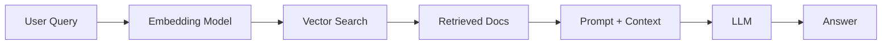
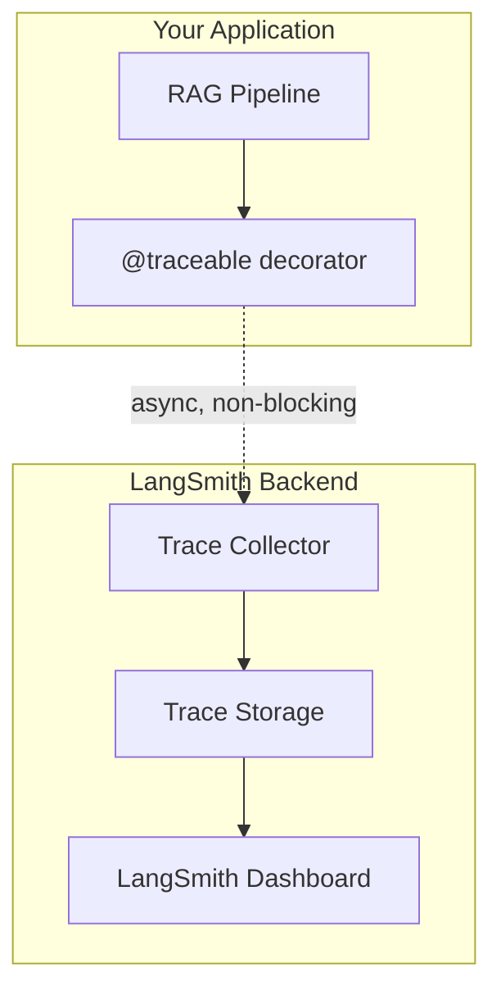

# RAG Systems in Production: From 40% Accuracy to 95% with LangSmith


How to trace, evaluate, and optimize Retrieval-Augmented Generation pipelines for production deployment. Learn to transform RAG systems from demo magic to battle-tested production systems with LangSmith.

## The RAG Performance Gap: Demo vs. Reality

You build a RAG chatbot for your company's documentation.

Demo day: "What's our refund policy?" → Perfect answer

Week 1 production: "How do I cancel my subscription?" → Hallucinated garbage

Week 2: Users stop using it

This pattern repeats across teams and companies. The demo works because you cherry-pick examples. Production reveals the harsh truth: most RAG systems achieve 40-60% accuracy in real-world scenarios. The problem isn't the LLM — it's that you have no visibility into why failures happen. You can't systematically improve because you're flying blind. Every change is a guess. Every bug fix potentially breaks something else. You're playing whack-a-mole with production issues, patching one symptom at a time without understanding the root cause.

The solution is observability. You need to see every step of the pipeline — from embedding to retrieval to generation — to understand where and why your system fails. LangSmith provides this visibility through distributed tracing, turning RAG from a black box into an inspectable, measurable system.

## RAG 101: What You Actually Need to Know



The three failure modes of RAG systems are:

1. Retrieval failure - wrong docs retrieved
2. Context failure - right docs, bad ranking
3. Generation failure - the LLM ignores the context

You can't fix what you can't see. Traditional logging shows inputs and outputs. LangSmith shows the entire pipeline, every step, every decision, every failure point.

## Production Horror Stories

Here are the kinds of issues that plague RAG systems in production, all of which are invisible without proper tracing:

**The embedding swap.** Someone changes the embedding model from text-embedding-3-small to text-embedding-3-large hoping to improve accuracy. Accuracy drops 30% because the new embeddings don't align with the existing vector store. Without tracing, it takes two weeks to discover the cause.

**The chunk size trap.** You optimize chunk size for better retrieval accuracy, and it works for 80% of queries. But 20% of edge cases break silently — users get irrelevant results and stop using the system. You only find out when user engagement metrics drop.

**The prompt drift.** You tweak the system prompt to fix one failure mode. It works. But six other queries that were working fine now return lower quality answers. You have no way to detect the regression because you can't see what changed.

These are not hypothetical. They happen constantly in real RAG deployments. The common thread is that every change has side effects you can't see without systematic evaluation and tracing.

## The Observability Problem

```python
def rag_query(question: str) -> str:
	docs = retriever.get_relevant_docs(question)
	answer = llm.generate(question, docs)
	return answer  # Why did it fail?
```

What you can't see:

- Which embedding model was actually used
- What similarity scores were returned for each doc
- Which chunks were retrieved vs ignored
- How the prompt was constructed before sending to the LLM
- Token usage and latency per step
- Why the model hallucinated instead of using the context

## Why LangSmith?

Basic logging is not enough. Traditional logging captures inputs and outputs but misses everything in between — which embedding model was used, what similarity scores were returned, which chunks were retrieved versus ignored, how the prompt was constructed before sending to the LLM, token usage and latency per step, and crucially, why the model hallucinated instead of using the provided context.

LangSmith gives trace-level observability, systematic evaluation, and a way to optimize the pipeline with real data instead of guesswork.

```python
import logging

logging.info(f"Query: {question}")
logging.info(f"Retrieved docs: {len(docs)}")
logging.info(f"Answer: {answer}")
logging.info(f"Latency: {latency}ms")
```

**The difference:** Basic logging shows you what happened. LangSmith tracing shows you why it happened — every retrieval, every embedding, every LLM call, all linked together with latency and cost data.

## Setting Up Tracing in Practice

Getting started with LangSmith tracing takes about 5 minutes. Set two environment variables and decorate your RAG function with `@traceable`:

```python
import os
os.environ["LANGCHAIN_TRACING_V2"] = "true"
os.environ["LANGCHAIN_API_KEY"] = "lsv2_pt_..."
os.environ["LANGCHAIN_PROJECT"] = "rag-production"

from langsmith import traceable
from langchain_openai import ChatOpenAI, OpenAIEmbeddings
from langchain_community.vectorstores import FAISS

@traceable
def rag_query(question: str) -> dict:
    embeddings = OpenAIEmbeddings()
    vectorstore = FAISS.load_local("./db", embeddings)
    docs = vectorstore.similarity_search(question, k=5)
    llm = ChatOpenAI(model="gpt-4", temperature=0)
    context = "\n".join([d.page_content for d in docs])
    prompt = f"Answer based on context only.\n\nContext: {context}\n\nQuestion: {question}"
    answer = llm.invoke(prompt)
    return {"answer": answer.content, "sources": [d.metadata for d in docs]}
```

Every call to `rag_query` now produces a full trace in LangSmith showing you the embedding call, the vector search with similarity scores, the prompt construction, the LLM invocation with token usage, the latency breakdown per step, and the total cost per query.

## LangSmith Architecture



Key insight: LangSmith runs async, so tracing adds essentially no latency to your production app.

## Setting Up Tracing

```python
import os
os.environ["LANGCHAIN_TRACING_V2"] = "true"
os.environ["LANGCHAIN_API_KEY"] = "lsv2_pt_..."
os.environ["LANGCHAIN_PROJECT"] = "rag-production"
```

```python
from langsmith import traceable
from langchain_openai import ChatOpenAI, OpenAIEmbeddings
from langchain_community.vectorstores import FAISS

@traceable
def rag_query(question: str) -> dict:
	embeddings = OpenAIEmbeddings()
	vectorstore = FAISS.load_local("./db", embeddings)
	docs = vectorstore.similarity_search(question, k=5)

	llm = ChatOpenAI(model="gpt-4", temperature=0)
	context = "\n".join([d.page_content for d in docs])

	prompt = f"""Answer based on context only.

Context: {context}

Question: {question}"""

	answer = llm.invoke(prompt)

	return {
		"answer": answer.content,
		"sources": [d.metadata for d in docs]
	}
```

## Running Automated Evaluations

Once you have traces flowing and datasets created, you can run automated evaluations. LangSmith lets you define custom evaluators that run against every trace:

```python
from langsmith import evaluate
from langsmith.evaluation import StringEvaluator

def accuracy_evaluator(run, example) -> dict:
    prediction = run.outputs.get("answer", "")
    reference = example.outputs.get("answer", "")
    score = 1.0 if prediction == reference else 0.0
    return {"key": "accuracy", "score": score}

evaluation_results = evaluate(
    dataset="rag-refund-policy",
    evaluators=[accuracy_evaluator]
)
```

This runs your RAG pipeline against every example in the dataset and calculates accuracy metrics automatically. You can run this on every code change to catch regressions before they reach production.

## Production Monitoring

Once your RAG system is in production, LangSmith's monitoring capabilities help you catch regressions before users notice them. Set up monitors for latency spikes (sudden increases in response time), error rates (failures in retrieval or generation), cost tracking (token usage per query), quality scores (automated evaluator scores over time), and user feedback (thumbs up/down correlated with traces).

When a monitor triggers, you can click through to the exact trace and see every step of the failing query. This turns debugging from "I heard users are unhappy" into "I can see that the retriever returned low-confidence chunks for this specific query type." You can then create a dataset entry from the failing trace, fix the issue, and verify the fix against your evaluation suite.

## Understanding Traces

```text
Trace: rag_query
├─ Duration: 2,347ms
├─ Cost: $0.0234
├─ Status: Success
│
├─ [Step 1] OpenAIEmbeddings.embed_query
├─ [Step 2] FAISS.similarity_search
└─ [Step 3] ChatOpenAI.invoke
```

What this reveals:

- Retrieval working when similarity scores are strong
- The LLM got the right context
- Latency is visible per step
- Cost per query is measurable

## Building Evaluation Datasets

Manual testing does not scale. You need a dataset of golden questions, edge cases, and production examples to systematically measure performance.

```python
from langsmith import Client

client = Client()

dataset = client.create_dataset(
	dataset_name="rag-refund-policy",
	description="Test cases for refund policy queries"
)

examples = [
    {"inputs": {"question": "What's your refund policy?"},
     "outputs": {"answer": "Full refund within 30 days of purchase."}},
    {"inputs": {"question": "Can I get a refund after 30 days?"},
     "outputs": {"answer": "Refunds are only available within 30 days."}},
]

for example in examples:
    client.create_example(dataset_id=dataset.id, inputs=example["inputs"], outputs=example["outputs"])
```

Dataset types:

| Type | Size | Use Case |
|---|---|---|
| Golden set | 10-20 | Core functionality, regression testing |
| Edge cases | 20-50 | Ambiguous queries, rare scenarios |
| Production sample | 100-500 | Representative real-world queries |
| Adversarial | 20-50 | Jailbreak attempts, hallucination triggers |

## The Optimization Cycle

RAG optimization follows a systematic cycle: baseline your current performance, run evaluation, identify the bottleneck, optimize, re-evaluate, and deploy. Each iteration reveals a new bottleneck to address.

Start by running your evaluation against the current system. LangSmith shows you exactly where failures happen — whether it's retrieval quality, context utilization, or generation accuracy. Once you know the bottleneck, apply a targeted fix and re-run the same evaluation to measure the impact.

Real example of this cycle in practice:

**Iteration 1 (Baseline):** chunk_size=512, k=5, no reranking. The evaluation reveals 75% overall accuracy with retrieval quality at 0.65. Many failures trace back to insufficient context coverage.

```python
vectorstore.similarity_search(question, k=5)
# Accuracy: 75%, Retrieval Quality: 0.65
```

**Iteration 2:** Increase retrieval k from 5 to 10. More docs means better coverage. Accuracy climbs to 78% with retrieval quality at 0.72. Cost increases 15% from the extra tokens.

```python
vectorstore.similarity_search(question, k=10)  # was k=5
# Accuracy: 78% (+3%), Retrieval Quality: 0.72 (+0.07)
```

**Iteration 3:** Add contextual compression reranking to filter irrelevant results. Accuracy jumps to 85% with retrieval quality at 0.81.

```python
from langchain.retrievers import ContextualCompressionRetriever
from langchain.retrievers.document_compressors import LLMChainExtractor

compressor = LLMChainExtractor.from_llm(llm)
retriever = ContextualCompressionRetriever(
    base_compressor=compressor,
    base_retriever=vectorstore.as_retriever(search_kwargs={"k": 10})
)
# Accuracy: 85% (+7%), Retrieval Quality: 0.81 (+0.09)
```

**Iteration 4:** Reduce chunk size from 512 to 256 for more precise matches. Accuracy climbs to 92% and latency drops by 200ms.

```python
# chunk_size=256 (was 512)
# Accuracy: 92% (+7%), Retrieval Quality: 0.88 (+0.07)
```

**Iteration 5:** Add BM25 keyword search with an ensemble retriever for hybrid search. This catches queries that semantic search misses. Final accuracy: 95%.

```python
from langchain.retrievers import EnsembleRetriever
from langchain_community.retrievers import BM25Retriever

bm25 = BM25Retriever.from_documents(docs)
ensemble = EnsembleRetriever(
    retrievers=[vectorstore.as_retriever(), bm25],
    weights=[0.7, 0.3]
)
# Accuracy: 95% (+3%), Retrieval Quality: 0.93 (+0.05)
```

| Metric | Baseline | Final | Change |
|---|---|---|---|
| Accuracy | 75% | 95% | +20% |
| Retrieval Quality | 0.65 | 0.93 | +43% |
| Latency | 2.3s | 2.1s | -9% |
| Cost/Query | $0.023 | $0.026 | +13% |

The final decision: +13% cost for +20% accuracy is worth it every time.

## Integrating with LangSmith for Automated Evaluation

Beyond basic tracing, LangSmith supports automated evaluators that score every trace. You can define custom evaluators for accuracy, helpfulness, tone, or any dimension relevant to your use case:

```python
from langsmith.evaluation import evaluate

def rag_accuracy(run, example) -> dict:
    answer = run.outputs.get("answer", "")
    expected = example.outputs.get("answer", "")
    contains_key_info = all(
        phrase in answer.lower()
        for phrase in expected.lower().split()
    )
    return {"key": "accuracy", "score": 1.0 if contains_key_info else 0.0}

evaluate(
    dataset="rag-refund-policy",
    evaluators=[rag_accuracy],
    experiment_prefix="v2-chunk-256",
)
```

This runs your entire RAG pipeline against every example in your dataset, scores each response, and gives you an aggregate accuracy score. Run this on every Pull Request to automatically catch regressions before they reach production.

## The Bottom Line

RAG without LangSmith means demos work but production fails. You have no visibility into failures, can't systematically improve, and manual testing doesn't scale. RAG with LangSmith means you can trace every step from embedding to retrieval to generation, evaluate systematically with datasets and automated evaluators, optimize using data instead of guesswork, and monitor production to catch regressions early.

**The numbers:** Baseline RAG systems typically achieve 40-60% accuracy. With evaluation-driven development, that climbs to 80-85%. With systematic optimization, 90-95%. And with production monitoring, you sustain 95%+.

**Time investment:** Setting up tracing takes 5 minutes. Building an evaluation dataset takes 2-4 hours. Running the first evaluation takes 30 minutes. Each optimization cycle takes 1-2 days. Production monitoring takes 15 minutes per day. The ROI: faster debugging (hours to minutes), higher quality (75% to 95% accuracy), lower costs (eliminate wasteful iterations), and user trust through consistent, reliable answers.

**Comparing experiments:** LangSmith lets you compare evaluation runs side by side. Run version A (your current system) and version B (your proposed change) against the same dataset. The comparison view shows which examples changed, by how much, and in which direction. This turns subjective "I think this is better" decisions into data-driven "this version improves accuracy by 5% on billing queries" choices.

LangSmith turns RAG from a black box into an observable, measurable, improvable system.
