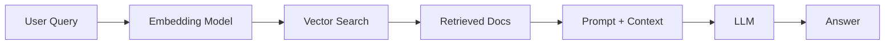
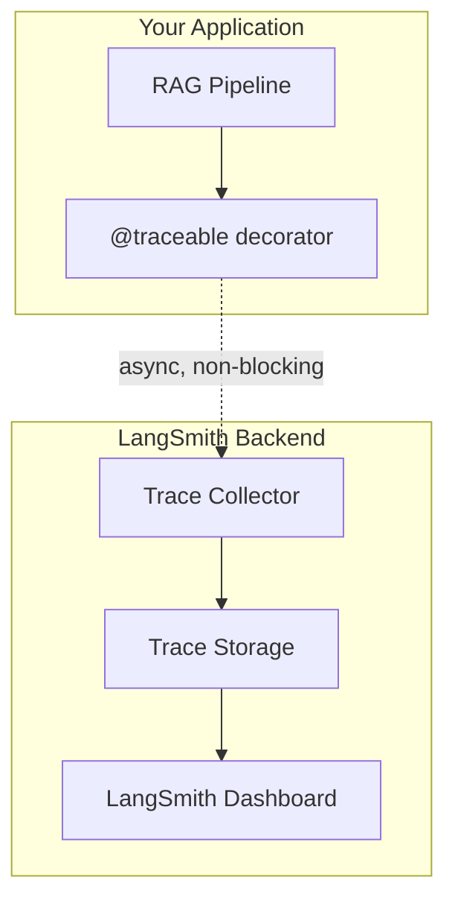

# RAG Systems in Production: From 40% Accuracy to 95% with LangSmith


How to trace, evaluate, and optimize Retrieval-Augmented Generation pipelines for production deployment. Learn to transform RAG systems from demo magic to battle-tested production systems with LangSmith.

## The RAG Performance Gap: Demo vs. Reality

You build a RAG chatbot for your company's documentation.

Demo day: "What's our refund policy?" → Perfect answer

Week 1 production: "How do I cancel my subscription?" → Hallucinated garbage

Week 2: Users stop using it

RAG demos look great when you cherry-pick examples. Production reveals the harsh truth: 40-60% accuracy in real-world scenarios. You have no visibility into why failures happen. You can't systematically improve because you're flying blind.

## RAG 101: What You Actually Need to Know



The three failure modes of RAG systems are:

1. Retrieval failure - wrong docs retrieved
2. Context failure - right docs, bad ranking
3. Generation failure - the LLM ignores the context

You can't fix what you can't see. Traditional logging shows inputs and outputs. LangSmith shows the entire pipeline, every step, every decision, every failure point.

## The Observability Problem

```python
def rag_query(question: str) -> str:
	docs = retriever.get_relevant_docs(question)
	answer = llm.generate(question, docs)
	return answer  # Why did it fail?
```

What you can't see:

- Which embedding model was actually used
- What similarity scores were returned for each doc
- Which chunks were retrieved vs ignored
- How the prompt was constructed before sending to the LLM
- Token usage and latency per step
- Why the model hallucinated instead of using the context

## Why LangSmith?

Basic logging is not enough. LangSmith gives trace-level observability, systematic evaluation, and a way to optimize the pipeline with real data instead of guesswork.

```python
import logging

logging.info(f"Query: {question}")
logging.info(f"Retrieved docs: {len(docs)}")
logging.info(f"Answer: {answer}")
logging.info(f"Latency: {latency}ms")
```

## LangSmith Architecture



Key insight: LangSmith runs async, so tracing adds essentially no latency to your production app.

## Setting Up Tracing

```python
import os
os.environ["LANGCHAIN_TRACING_V2"] = "true"
os.environ["LANGCHAIN_API_KEY"] = "lsv2_pt_..."
os.environ["LANGCHAIN_PROJECT"] = "rag-production"
```

```python
from langsmith import traceable
from langchain_openai import ChatOpenAI, OpenAIEmbeddings
from langchain_community.vectorstores import FAISS

@traceable
def rag_query(question: str) -> dict:
	embeddings = OpenAIEmbeddings()
	vectorstore = FAISS.load_local("./db", embeddings)
	docs = vectorstore.similarity_search(question, k=5)

	llm = ChatOpenAI(model="gpt-4", temperature=0)
	context = "\n".join([d.page_content for d in docs])

	prompt = f"""Answer based on context only.

Context: {context}

Question: {question}"""

	answer = llm.invoke(prompt)

	return {
		"answer": answer.content,
		"sources": [d.metadata for d in docs]
	}
```

## Understanding Traces

```text
Trace: rag_query
├─ Duration: 2,347ms
├─ Cost: $0.0234
├─ Status: Success
│
├─ [Step 1] OpenAIEmbeddings.embed_query
├─ [Step 2] FAISS.similarity_search
└─ [Step 3] ChatOpenAI.invoke
```

What this reveals:

- Retrieval working when similarity scores are strong
- The LLM got the right context
- Latency is visible per step
- Cost per query is measurable

## Building Evaluation Datasets

Manual testing does not scale. You need a dataset of golden questions, edge cases, and production examples.

```python
from langsmith import Client

client = Client()

dataset = client.create_dataset(
	dataset_name="rag-refund-policy",
	description="Test cases for refund policy queries"
)
```

Dataset types:

- Golden set - core functionality
- Edge cases - ambiguous queries and rare scenarios
- Production sample - representative real-world queries
- Adversarial - jailbreak attempts and hallucination triggers

## The Bottom Line

LangSmith turns RAG from a black box into an observable system. Once you can trace every step, you can debug it, measure it, and improve it.
