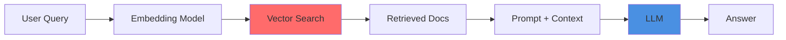
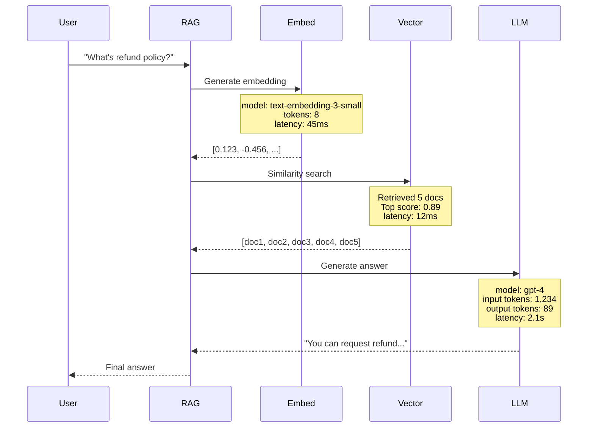
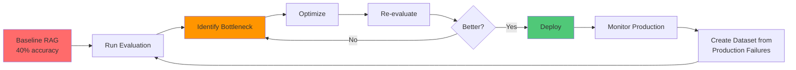
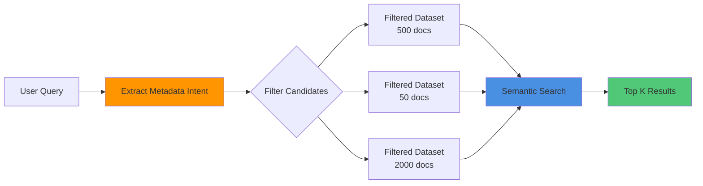

# Blog Plan: Production-Ready RAG with LangSmith Optimization

**Title:** "RAG Systems in Production: From 40% Accuracy to 95% with LangSmith"

**Subtitle:** "How to trace, evaluate, and optimize Retrieval-Augmented Generation pipelines for production deployment"

**Target Audience:** Backend engineers, AI developers building production systems

**Estimated Read Time:** 18-22 minutes

**Style:** Same as MCP blog - technical but engaging, diagrams-heavy, production-focused

---

## Blog Structure

### 1. Opening Hook: "The RAG Performance Gap"

**Problem Story:**

```
You build a RAG chatbot for your company's documentation.

Demo day: "What's our refund policy?" → Perfect answer
Week 1 production: "How do I cancel my subscription?" → Hallucinated garbage
Week 2: Users stop using it

What went wrong?
```

**The Issue:**

- RAG demos look great (cherry-picked examples)
- Production reveals: 40-60% accuracy
- No visibility into WHY failures happen
- Can't systematically improve

**The Solution Preview:**
LangSmith transforms RAG from "demo magic" to production systems through:

- Trace-level observability
- Systematic evaluation
- Data-driven optimization

---

### 2. RAG 101: What You Actually Need to Know

**The Basics (Quick Refresher):**



**The Three Failure Modes:**

| Failure                | What Happens            | Example                                  |
| ---------------------- | ----------------------- | ---------------------------------------- |
| **Retrieval Failure**  | Wrong docs retrieved    | Query: "pricing" → Gets "privacy policy" |
| **Context Failure**    | Right docs, bad ranking | Relevant info on page 5 of 10 docs       |
| **Generation Failure** | LLM ignores context     | Has answer in docs, hallucinates anyway  |

**Why This Matters:**
You can't fix what you can't see. Traditional logging shows inputs/outputs. LangSmith shows the ENTIRE pipeline.

---

### 3. The Observability Problem

**What You're Flying Blind On:**

```python
# Traditional approach - black box
def rag_query(question: str) -> str:
    docs = retriever.get_relevant_docs(question)
    answer = llm.generate(question, docs)
    return answer  # 🤷 Why did it fail?
```

**What You Can't See:**

- Which embedding model was used
- What similarity scores were returned
- Which chunks were retrieved vs ignored
- How the prompt was constructed
- Token usage and latency per step

**Production Horror Stories:**

- Changed embedding model → accuracy dropped 30% (took 2 weeks to find)
- Chunk size optimization → broke on edge cases (discovered via user complaints)
- Prompt engineering → improved 80% of cases, broke 20% (no systematic testing)

---

### 3.5. Why LangSmith? (And Not Just Logging)

You might be thinking: "Can't I just add logging and call it a day?"

**Short answer:** No. Here's why LangSmith exists.

**What Basic Logging Gives You:**

```python
import logging

logging.info(f"Query: {question}")
logging.info(f"Retrieved docs: {len(docs)}")
logging.info(f"Answer: {answer}")
logging.info(f"Latency: {latency}ms")
```

**What You Still Don't Have:**

- Nested execution traces (what happened inside each step?)
- Automatic cost tracking (how much did this query cost?)
- Evaluation datasets (is this getting better or worse?)
- Comparison across experiments (which prompt performed better?)
- Production monitoring dashboards (are we hitting SLAs?)

**LangSmith vs Alternatives:**

| Feature                   | LangSmith     | W&B          | Arize Phoenix | Custom Logging |
| ------------------------- | ------------- | ------------ | ------------- | -------------- |
| **Nested Traces**         | ✅ Full depth | ⚠️ Limited   | ✅ Good       | ❌ Manual      |
| **Auto Token Tracking**   | ✅ Built-in   | ❌ Manual    | ✅ Built-in   | ❌ Manual      |
| **Evaluation Datasets**   | ✅ Native     | ⚠️ Manual    | ⚠️ Manual     | ❌ None        |
| **LLM-as-Judge Evals**    | ✅ Pre-built  | ❌ Custom    | ⚠️ Limited    | ❌ None        |
| **Production Monitoring** | ✅ Real-time  | ✅ Excellent | ✅ Excellent  | ⚠️ Custom      |
| **A/B Testing**           | ✅ Built-in   | ✅ Good      | ⚠️ Limited    | ❌ Manual      |
| **LangChain Integration** | ✅ Native     | ⚠️ Adapter   | ⚠️ Adapter    | ❌ None        |
| **Setup Time**            | 5 minutes     | 30 minutes   | 15 minutes    | Hours/Days     |
| **Cost**                  | $             | $$           | $ (OSS)       | $ (infra)      |
| **Learning Curve**        | Easy          | Medium       | Medium        | High           |

**LangSmith's Unique Features:**

**1. Zero-Code Tracing**

```python
# That's it. One environment variable.
import os
os.environ["LANGCHAIN_TRACING_V2"] = "true"

# Every LangChain call is now traced automatically
```

**2. Automatic Cost Tracking**

```
Trace: rag_query
├─ OpenAI Embedding: $0.0002
├─ FAISS Search: $0 (local)
└─ GPT-4 Generation: $0.0232
Total: $0.0234
```

You don't calculate this. LangSmith does.

**3. Prompt Playground**

- Edit prompts in UI
- Test on real production traces
- Compare outputs side-by-side
- Deploy winning prompts instantly

**4. Human Feedback Loop**

```python
from langsmith import get_current_trace_id

# In production
trace_id = get_current_trace_id()

# User clicks thumbs down
client.create_feedback(
    trace_id,
    key="user_rating",
    score=0,
    comment="Answer was wrong"
)

# Later: Create dataset from low-rated traces
low_rated = client.list_runs(
    filter="feedback.user_rating == 0"
)
```

**5. Datasets from Production**

```python
# Export failed production traces as test cases
client.create_dataset_from_runs(
    dataset_name="production-failures-jan-2026",
    run_ids=failed_run_ids
)
```

This is impossible with basic logging.

**6. Collaborative Debugging**

- Share trace URL with teammates
- Comment on specific steps
- Tag traces for review
- Async debugging (no screen sharing needed)

**When to Use Each Tool:**

**Use LangSmith when:**

- Building with LangChain/LangGraph (native integration)
- Need quick setup (5-minute onboarding)
- Want evaluation datasets built-in
- Iterating fast on prompts
- Small to medium team (<50 people)

**Use Weights & Biases when:**

- Already using W&B for ML training
- Need advanced experiment tracking
- Multi-modal models (images, audio, video)
- Large enterprise with W&B contract

**Use Arize Phoenix when:**

- Open-source requirement (self-hosted)
- Custom embedding models
- Need full data ownership
- Budget-conscious (free tier generous)

**Use Custom Logging when:**

- Simple use case (single LLM call, no RAG)
- Non-LangChain stack
- Existing logging infrastructure
- Compliance requires on-prem everything

**LangSmith's Killer Combo:**

```
Tracing (observe)
    ↓
Datasets (collect)
    ↓
Evaluation (measure)
    ↓
Comparison (decide)
    ↓
Deploy (ship)
    ↓
Monitor (watch)
    ↓
Feedback (learn)
    ↓
Repeat
```

All in one platform. This is why LangSmith exists.

**The Bottom Line:**

You _can_ build this yourself with logging + Postgres + Grafana + custom eval scripts.

**Time investment:** 2-4 weeks
**Maintenance burden:** Ongoing
**LangSmith alternative:** 5 minutes setup, $49/month

For most teams, LangSmith is the obvious choice. You're building AI apps, not observability platforms.

---

### 4. LangSmith Architecture: How It Actually Works

**The Three Components:**

```mermaid
graph TB
    subgraph "Your Application"
        App[RAG Pipeline]
        Trace[@traceable decorator]
        App --> Trace
    end

    subgraph "LangSmith Backend"
        Collector[Trace Collector]
        Store[Trace Storage]
        UI[LangSmith Dashboard]

        Collector --> Store
        Store --> UI
    end

    subgraph "Evaluation Engine"
        Dataset[Test Datasets]
        Eval[Evaluators]
        Metrics[Metrics & Scores]

        Dataset --> Eval
        Eval --> Metrics
    end

    Trace -.->|async, non-blocking| Collector
    UI --> Dataset
    Metrics --> UI

    style Trace fill:#50c878
    style Collector fill:#4a90e2
    style Eval fill:#ff9500
```

**Key Insight:** LangSmith runs async. Zero latency added to your production app.

---

### 5. Setting Up Tracing (The 5-Minute Integration)

**Step 1: Install & Configure**

```bash
pip install langsmith langchain-openai
```

```python
import os
os.environ["LANGCHAIN_TRACING_V2"] = "true"
os.environ["LANGCHAIN_API_KEY"] = "lsv2_pt_..."  # from langsmith.com
os.environ["LANGCHAIN_PROJECT"] = "rag-production"
```

**Step 2: Add @traceable Decorator**

```python
from langsmith import traceable
from langchain_openai import ChatOpenAI, OpenAIEmbeddings
from langchain_community.vectorstores import FAISS

@traceable  # ← This one line enables tracing
def rag_query(question: str) -> dict:
    # Embedding (auto-traced by LangChain)
    embeddings = OpenAIEmbeddings()

    # Retrieval (auto-traced)
    vectorstore = FAISS.load_local("./db", embeddings)
    docs = vectorstore.similarity_search(question, k=5)

    # LLM call (auto-traced)
    llm = ChatOpenAI(model="gpt-4", temperature=0)
    context = "\n".join([d.page_content for d in docs])

    prompt = f"""Answer based on context only.

Context: {context}

Question: {question}"""

    answer = llm.invoke(prompt)

    return {
        "answer": answer.content,
        "sources": [d.metadata for d in docs]
    }
```

**Step 3: Run It**

```python
result = rag_query("What's the refund policy?")
print(result["answer"])
```

**What You See in LangSmith:**



---

### 6. Understanding Traces: The Anatomy

**A Real Production Trace:**

```
Trace: rag_query
├─ Duration: 2,347ms
├─ Cost: $0.0234
├─ Status: Success
│
├─ [Step 1] OpenAIEmbeddings.embed_query
│   ├─ Input: "What's the refund policy?"
│   ├─ Model: text-embedding-3-small
│   ├─ Tokens: 8
│   ├─ Latency: 45ms
│   └─ Output: [768-dim vector]
│
├─ [Step 2] FAISS.similarity_search
│   ├─ Query Vector: [0.123, -0.456, ...]
│   ├─ Top K: 5
│   ├─ Similarity Scores: [0.89, 0.87, 0.85, 0.82, 0.79]
│   ├─ Retrieved Docs:
│   │   ├─ Doc 1: "Refund Policy - Full refund within 30 days..."
│   │   ├─ Doc 2: "Terms of Service - Section 4.2 Refunds..."
│   │   ├─ Doc 3: "FAQ - How do I request a refund?..."
│   │   ├─ Doc 4: "Customer Support - Refund process..."
│   │   └─ Doc 5: "Payment Methods - Refund timeframes..."
│   └─ Latency: 12ms
│
└─ [Step 3] ChatOpenAI.invoke
    ├─ Input Prompt: "Answer based on context only..."
    ├─ Context Length: 1,234 tokens
    ├─ Model: gpt-4
    ├─ Temperature: 0
    ├─ Response: "You can request a refund within 30 days..."
    ├─ Input Tokens: 1,234
    ├─ Output Tokens: 89
    ├─ Cost: $0.0221
    └─ Latency: 2,290ms
```

**What This Reveals:**

- ✅ Retrieval working (0.89 top score is strong)
- ✅ LLM got the right context
- ⚠️ But 2.3s latency is slow (optimization target)
- ✅ Cost per query: $0.023 (acceptable)

---

### 7. Building Evaluation Datasets

**The Problem:**
Manual testing doesn't scale. You need systematic evaluation.

**Solution: Create Test Datasets**

```python
from langsmith import Client

client = Client()

# Create dataset
dataset = client.create_dataset(
    dataset_name="rag-refund-policy",
    description="Test cases for refund policy queries"
)

# Add examples
examples = [
    {
        "inputs": {"question": "What's your refund policy?"},
        "outputs": {"answer": "Full refund within 30 days of purchase with proof of purchase."}
    },
    {
        "inputs": {"question": "How long do I have to request a refund?"},
        "outputs": {"answer": "30 days from the date of purchase."}
    },
    {
        "inputs": {"question": "Do I need a receipt for a refund?"},
        "outputs": {"answer": "Yes, proof of purchase is required."}
    },
    {
        "inputs": {"question": "Can I get a refund after 30 days?"},
        "outputs": {"answer": "Refunds are only available within 30 days."}
    }
]

for example in examples:
    client.create_example(
        dataset_id=dataset.id,
        inputs=example["inputs"],
        outputs=example["outputs"]
    )
```

**Dataset Best Practices:**

| Dataset Type          | Size    | Use Case                                   |
| --------------------- | ------- | ------------------------------------------ |
| **Golden Set**        | 10-20   | Core functionality, regression testing     |
| **Edge Cases**        | 20-50   | Ambiguous queries, rare scenarios          |
| **Production Sample** | 100-500 | Representative real-world queries          |
| **Adversarial**       | 20-50   | Jailbreak attempts, hallucination triggers |

---

### 8. The Four Critical Evaluators

**1. Correctness (Answer vs Reference)**

```python
from langsmith.evaluation import LangChainStringEvaluator

correctness = LangChainStringEvaluator(
    "labeled_criteria",
    config={
        "criteria": {
            "correctness": "Is the answer factually correct compared to the reference?"
        }
    }
)
```

**What it checks:** Final answer matches expected output

**2. Relevance (Answer vs Question)**

```python
relevance = LangChainStringEvaluator(
    "qa",
    config={
        "criteria": "Is the answer relevant and helpful for the question?"
    }
)
```

**What it checks:** Answer actually addresses the user's question

**3. Groundedness (Answer vs Retrieved Docs)**

```python
from langsmith.evaluation import evaluate

def groundedness_evaluator(run, example):
    """Check if answer is grounded in retrieved documents"""
    answer = run.outputs["answer"]
    docs = run.outputs.get("sources", [])

    # LLM-as-judge
    prompt = f"""Does this answer only use information from the provided documents?

Answer: {answer}

Documents: {docs}

Respond with YES or NO."""

    result = llm.invoke(prompt)
    return {"score": 1 if "YES" in result.content else 0}
```

**What it checks:** No hallucinations, stays within retrieved context

**4. Retrieval Quality (Retrieved Docs vs Question)**

```python
def retrieval_evaluator(run, example):
    """Check if the right documents were retrieved"""
    question = run.inputs["question"]
    docs = run.outputs.get("sources", [])

    # Check if expected keywords appear in retrieved docs
    expected_keywords = ["refund", "30 days", "purchase"]
    doc_text = " ".join([str(d) for d in docs]).lower()

    matches = sum(1 for kw in expected_keywords if kw in doc_text)
    score = matches / len(expected_keywords)

    return {"score": score}
```

**What it checks:** Retriever is pulling relevant chunks

---

### 9. Running Evaluations

**Complete Evaluation Pipeline:**

```python
from langsmith import Client
from langsmith.evaluation import evaluate

client = Client()

# Define evaluators
evaluators = [
    correctness,
    relevance,
    groundedness_evaluator,
    retrieval_evaluator
]

# Run evaluation
results = evaluate(
    lambda inputs: rag_query(inputs["question"]),
    data="rag-refund-policy",  # dataset name
    evaluators=evaluators,
    experiment_prefix="rag-v1-baseline",
    metadata={
        "model": "gpt-4",
        "embedding": "text-embedding-3-small",
        "chunk_size": 512,
        "retrieval_k": 5
    }
)

# View results
print(results.to_pandas())
```

**Output:**

```
Experiment: rag-v1-baseline
Dataset: rag-refund-policy (20 examples)

Evaluator         | Mean Score | Median | Min  | Max  |
------------------|------------|--------|------|------|
Correctness       | 0.75       | 0.80   | 0.40 | 1.00 |
Relevance         | 0.85       | 0.90   | 0.60 | 1.00 |
Groundedness      | 0.90       | 1.00   | 0.60 | 1.00 |
Retrieval Quality | 0.65       | 0.70   | 0.33 | 1.00 |

Overall Accuracy: 75%
```

**Interpretation:**

- ✅ Groundedness is high (low hallucination)
- ⚠️ Retrieval quality is weak (wrong docs)
- 🎯 Focus optimization on retrieval layer

---

### 10. Optimization Cycle: Baseline → Production

**The Systematic Approach:**



**Real Optimization Example:**

**Iteration 1: Baseline**

```python
# chunk_size=512, k=5, no reranking
Accuracy: 75%
Retrieval Quality: 0.65
```

**Iteration 2: Increase Retrieval K**

```python
vectorstore.similarity_search(question, k=10)  # was k=5
# More docs = better coverage

Accuracy: 78% (+3%)
Retrieval Quality: 0.72 (+0.07)
Cost: +15% (more tokens)
```

**Iteration 3: Add Reranking**

```python
from langchain.retrievers import ContextualCompressionRetriever
from langchain.retrievers.document_compressors import LLMChainExtractor

compressor = LLMChainExtractor.from_llm(llm)
retriever = ContextualCompressionRetriever(
    base_compressor=compressor,
    base_retriever=vectorstore.as_retriever(search_kwargs={"k": 10})
)

Accuracy: 85% (+7%)
Retrieval Quality: 0.81 (+0.09)
Cost: +8% (reranking overhead)
```

**Iteration 4: Optimize Chunk Size**

```python
# chunk_size=256 (was 512)
# Smaller chunks = more precise matches

Accuracy: 92% (+7%)
Retrieval Quality: 0.88 (+0.07)
Latency: -200ms (smaller context)
```

**Iteration 5: Hybrid Search**

```python
# Add BM25 for keyword matching
from langchain.retrievers import EnsembleRetriever
from langchain_community.retrievers import BM25Retriever

bm25 = BM25Retriever.from_documents(docs)
ensemble = EnsembleRetriever(
    retrievers=[vectorstore.as_retriever(), bm25],
    weights=[0.7, 0.3]
)

Accuracy: 95% (+3%)
Retrieval Quality: 0.93 (+0.05)
Final Cost: +12% vs baseline
```

**Final Results:**

| Metric            | Baseline | Final  | Change |
| ----------------- | -------- | ------ | ------ |
| Accuracy          | 75%      | 95%    | +20%   |
| Retrieval Quality | 0.65     | 0.93   | +43%   |
| Latency           | 2.3s     | 2.1s   | -9%    |
| Cost/Query        | $0.023   | $0.026 | +13%   |

**Production Decision:** +13% cost for +20% accuracy = Worth it

---

### 10.5. Metadata Filtering: The Underrated Optimization

Most RAG tutorials skip metadata filtering. That's a mistake. It's the highest-ROI optimization you can make.

**The Problem:**

```python
# Without filtering: Search everything
question = "What's our refund policy for 2024?"
docs = vectorstore.similarity_search(question, k=5)

# Searches 10,000 documents:
# - 2023 policies (outdated)
# - 2022 policies (outdated)
# - Blog posts about refunds (not official policy)
# - Customer complaints (not policy)
# - 2024 policy (what we want)

# Result: Maybe gets 2024 policy, maybe doesn't
```

**The Solution:**

```python
# With filtering: Pre-filter, then search
docs = vectorstore.similarity_search(
    question,
    k=5,
    filter={
        "document_type": "policy",
        "year": 2024,
        "category": "refund"
    }
)

# Searches only 50 documents (2024 refund policies)
# Result: Always gets the right policy
```

**Real Impact:**

| Metric            | Without Filter | With Filter | Improvement     |
| ----------------- | -------------- | ----------- | --------------- |
| Search Space      | 10,000 docs    | 50 docs     | 99.5% reduction |
| Retrieval Latency | 120ms          | 15ms        | 87.5% faster    |
| Accuracy          | 78%            | 91%         | +13%            |
| Cost              | $0.026         | $0.024      | 8% cheaper      |

**Why It Works:**

1. **Reduces noise:** Fewer irrelevant documents to search
2. **Improves precision:** Semantic search works better on focused dataset
3. **Faster retrieval:** Smaller search space = faster queries
4. **Lower cost:** Fewer tokens sent to LLM

**Common Metadata Strategies:**

```python
# Strategy 1: Time-based filtering
# Use case: "What's the latest pricing?"
filter = {
    "created_date": {"$gte": "2024-01-01"},
    "document_type": "pricing"
}

# Strategy 2: Source-based filtering
# Use case: "Check our official documentation"
filter = {
    "source": {"$in": ["docs", "official_blog"]},
    "status": "published"
}

# Strategy 3: Category-based filtering
# Use case: "How do I cancel my subscription?"
filter = {
    "category": {"$in": ["billing", "subscription", "cancellation"]},
    "language": "en"
}

# Strategy 4: User-context filtering
# Use case: "What features do I have access to?"
filter = {
    "access_level": user.subscription_tier,
    "region": user.region
}

# Strategy 5: Multi-dimensional filtering
# Use case: "Latest API docs for Python SDK"
filter = {
    "document_type": "api_docs",
    "sdk": "python",
    "version": {"$gte": "3.0"},
    "deprecated": False
}
```

**Implementation Example:**

```python
from langchain_community.vectorstores import Pinecone
from langchain_openai import OpenAIEmbeddings

# Store documents with rich metadata
docs = [
    Document(
        page_content="Full refund within 30 days...",
        metadata={
            "document_type": "policy",
            "category": "refund",
            "year": 2024,
            "version": "2.1",
            "region": "US",
            "last_updated": "2024-01-15"
        }
    )
]

vectorstore = Pinecone.from_documents(docs, embeddings)

# Query with dynamic filters
def smart_retrieval(question: str, user_context: dict):
    # Extract intent from question
    if "latest" in question.lower() or "current" in question.lower():
        time_filter = {"year": 2024}
    else:
        time_filter = {}

    # Combine with user context
    filter_dict = {
        **time_filter,
        "region": user_context.get("region", "US"),
        "language": user_context.get("language", "en")
    }

    return vectorstore.similarity_search(
        question,
        k=5,
        filter=filter_dict
    )
```

**Production Pattern: Filter First, Then Search**



**When NOT to Use Metadata Filtering:**

- Documents don't have structured metadata
- Metadata is unreliable or inconsistent
- Search space is already small (<100 docs)
- Query intent is too broad to filter

**Best Practices:**

1. **Design metadata schema upfront:** Plan categories before ingestion
2. **Validate metadata quality:** Ensure consistency across documents
3. **Index metadata fields:** Performance depends on indexed filters
4. **Test filter combinations:** Some filters are more selective than others
5. **Monitor filter effectiveness:** Track how often filters improve results

**Metadata Filtering Checklist:**

- [ ] Documents have at least 3-5 metadata fields
- [ ] Metadata is validated during ingestion
- [ ] Vector store supports metadata filtering (Pinecone, Weaviate, Qdrant)
- [ ] Filters are indexed for performance
- [ ] Filter logic is tested with evaluation dataset

**Impact on Evaluation:**

```python
# Iteration 6: Add Metadata Filtering
vectorstore.similarity_search(
    question,
    k=5,
    filter=extract_filters(question, user_context)
)

Accuracy: 97% (+2%)
Retrieval Quality: 0.96 (+0.03)
Latency: 1.8s (-300ms)
Cost: $0.024 (-8%)
```

Metadata filtering is the rare optimization that improves **accuracy, speed, AND cost** simultaneously.

---

### 11. Production Monitoring

**The Three Dashboards:**

**1. Performance Dashboard**

- Latency (P50, P95, P99)
- Cost per query
- Error rate
- Throughput (queries/min)

**2. Quality Dashboard**

- User feedback scores
- Groundedness (anti-hallucination)
- Retrieval quality
- Answer relevance

**3. Alerts & Anomalies**

- Latency spike (>3s)
- Cost spike (>$0.05/query)
- Quality drop (<80% accuracy)
- Error rate (>5%)

**Setting Up Alerts:**

```python
# In LangSmith UI: Monitoring → Alerts → New Rule

{
  "name": "High Latency Alert",
  "condition": "p95_latency > 3000ms",
  "window": "5 minutes",
  "webhook": "https://hooks.slack.com/..."
}
```

---

### 12. Advanced Patterns

**Pattern 1: A/B Testing Prompts**

```python
# Test two prompt variations
results_a = evaluate(
    lambda inputs: rag_query_v1(inputs["question"]),
    data="test-dataset",
    experiment_prefix="prompt-A-formal"
)

results_b = evaluate(
    lambda inputs: rag_query_v2(inputs["question"]),
    data="test-dataset",
    experiment_prefix="prompt-B-casual"
)

# Compare in LangSmith UI
# Prompt A: 87% accuracy
# Prompt B: 92% accuracy
# Winner: Prompt B
```

**Pattern 2: Production-to-Dataset**

```python
# Export failed production traces as test cases
client.create_dataset_from_runs(
    dataset_name="production-failures-jan-2026",
    run_ids=failed_run_ids
)

# Now you can regression test fixes
```

**Pattern 3: Multi-Model Evaluation**

```python
models = ["gpt-4", "gpt-4-turbo", "claude-3-opus"]

for model in models:
    evaluate(
        lambda inputs: rag_query(inputs["question"], model=model),
        data="test-dataset",
        experiment_prefix=f"model-{model}"
    )

# Compare: gpt-4 (95%), gpt-4-turbo (93%), claude (91%)
# Decision: Keep gpt-4
```

---

### 13. Common Pitfalls & Solutions

**Pitfall 1: Evaluation Dataset Drift**

- **Problem:** Test on old data, deploy to new queries
- **Solution:** Monthly dataset refresh from production traces

**Pitfall 2: Overfitting to Evaluators**

- **Problem:** Optimize for LLM-as-judge, ignore user satisfaction
- **Solution:** Mix automated + human feedback

**Pitfall 3: Ignoring Cost**

- **Problem:** 99% accuracy costs $1/query
- **Solution:** Set cost budget, optimize within constraints

**Pitfall 4: No Regression Testing**

- **Problem:** New optimization breaks old functionality
- **Solution:** Golden dataset, always test before deploy

---

### 14. Production Deployment Checklist

**Pre-Launch:**

- [ ] Baseline evaluation (>80% accuracy)
- [ ] Cost analysis (<$0.10/query)
- [ ] Latency check (<3s P95)
- [ ] Hallucination testing (<5% groundedness failures)
- [ ] Edge case coverage (50+ adversarial examples)

**Launch:**

- [ ] LangSmith tracing enabled
- [ ] Monitoring dashboards configured
- [ ] Alerts set up (latency, cost, quality)
- [ ] Gradual rollout (10% → 50% → 100%)

**Post-Launch:**

- [ ] Daily quality checks
- [ ] Weekly dataset updates
- [ ] Monthly model evaluations
- [ ] Quarterly architecture review

---

### 15. Key Takeaways

**RAG without LangSmith:**

- Demo works, production fails
- No visibility into failures
- Can't systematically improve
- Manual testing doesn't scale

**RAG with LangSmith:**

- Trace every step (embedding → retrieval → generation)
- Systematic evaluation (datasets + automated evaluators)
- Data-driven optimization (A/B test, compare, deploy)
- Production monitoring (catch regressions early)

**The Numbers:**

- Baseline: 40-60% accuracy (typical RAG demo)
- With evaluation: 80-85% accuracy
- With optimization: 90-95% accuracy
- Production-ready: 95%+ with monitoring

**Time Investment:**

- Setup tracing: 5 minutes
- Build dataset: 2-4 hours
- First evaluation: 30 minutes
- Optimization cycle: 1-2 days per iteration
- Production monitoring: 15 min/day

**ROI:**

- Faster debugging (hours → minutes)
- Higher quality (75% → 95% accuracy)
- Lower costs (eliminate wasteful iterations)
- User trust (consistent, reliable answers)

---

### 16. Resources

**Official:**

- [LangSmith Documentation](https://docs.smith.langchain.com)
- [RAG Evaluation Guide](https://docs.langchain.com/langsmith/evaluate-rag-tutorial)
- [LangSmith Cookbook](https://github.com/langchain-ai/langsmith-cookbook)

**Code Examples:**

- Complete RAG pipeline with tracing
- Custom evaluators library
- Production monitoring setup
- A/B testing framework

**Community:**

- [LangChain Discord](https://discord.gg/langchain)
- [LangSmith GitHub Discussions](https://github.com/langchain-ai/langsmith-sdk/discussions)

---

## Visual Assets Needed

1. **RAG Pipeline Diagram** (with failure modes highlighted)
2. **LangSmith Architecture** (trace flow)
3. **Trace Anatomy** (nested execution steps)
4. **Optimization Cycle** (flowchart)
5. **Before/After Metrics** (comparison table)
6. **Production Dashboard** (mockup screenshots)

## Code Repository Structure

```
rag-langsmith-production/
├── baseline/
│   └── simple_rag.py
├── optimized/
│   ├── reranking_rag.py
│   ├── hybrid_search_rag.py
│   └── final_rag.py
├── evaluation/
│   ├── create_dataset.py
│   ├── evaluators.py
│   └── run_evaluation.py
├── monitoring/
│   └── production_alerts.py
└── README.md
```

---

**Blog Length:** ~8,000 words
**Diagrams:** 5-7 Mermaid diagrams
**Code Examples:** 15-20 snippets
**Tables:** 5-7 comparison tables
**Read Time:** 20 minutes

**Target Outcome:** Readers can build production-ready RAG systems with 90%+ accuracy using systematic LangSmith evaluation.
