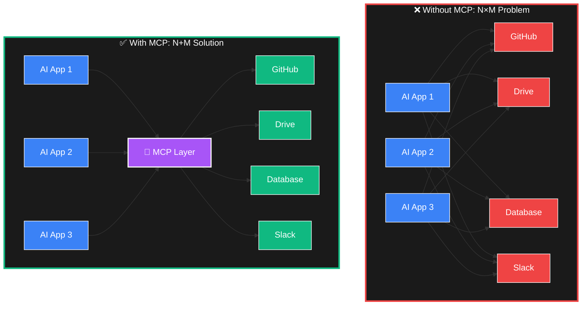
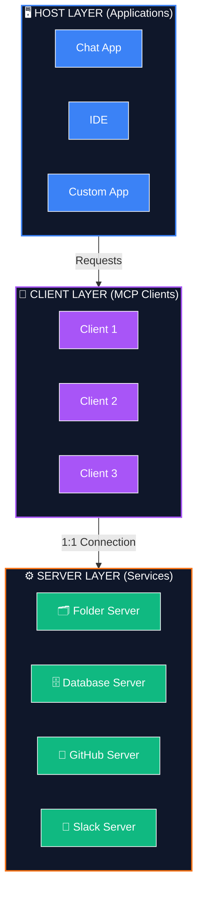
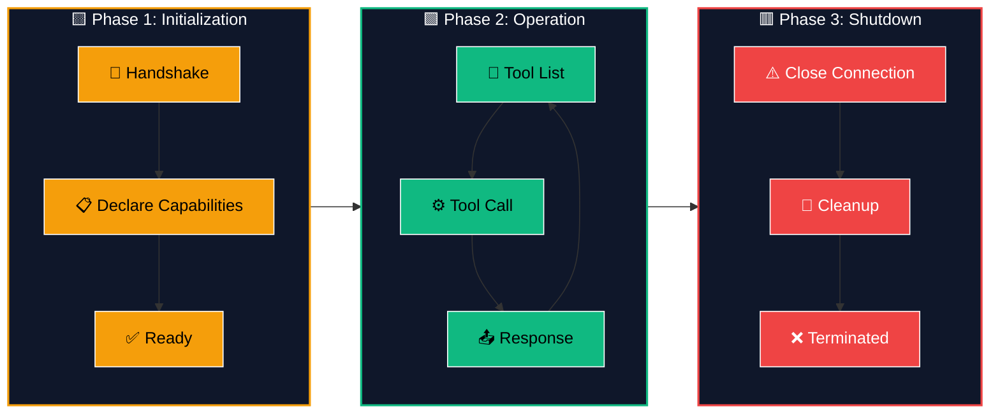
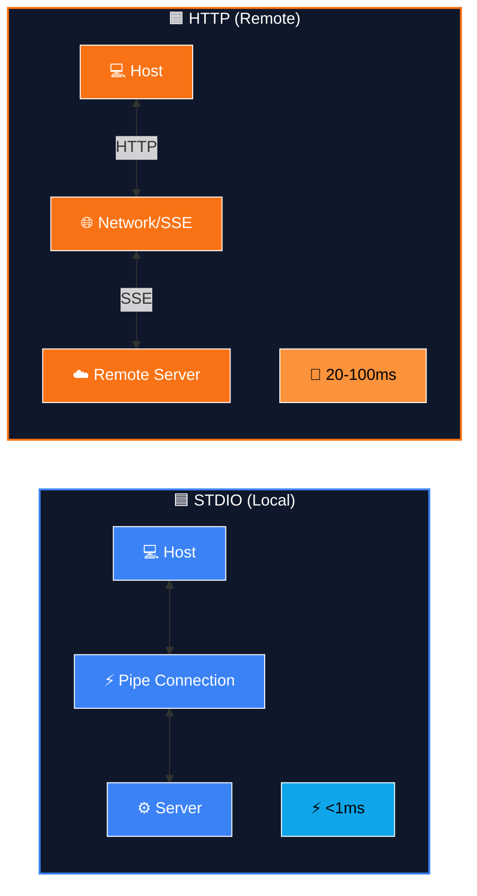
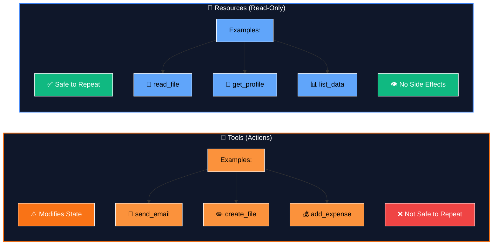
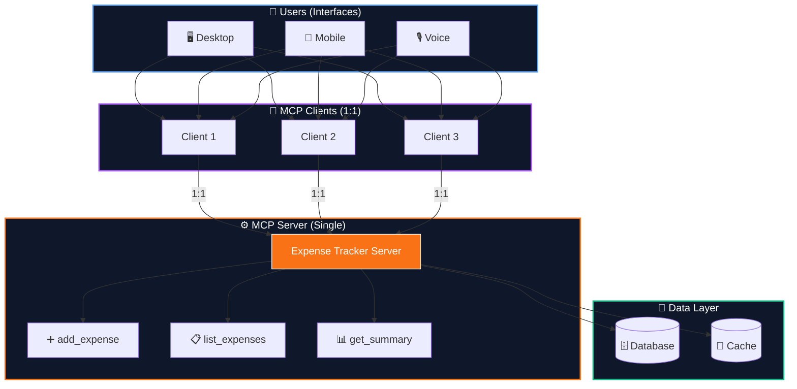
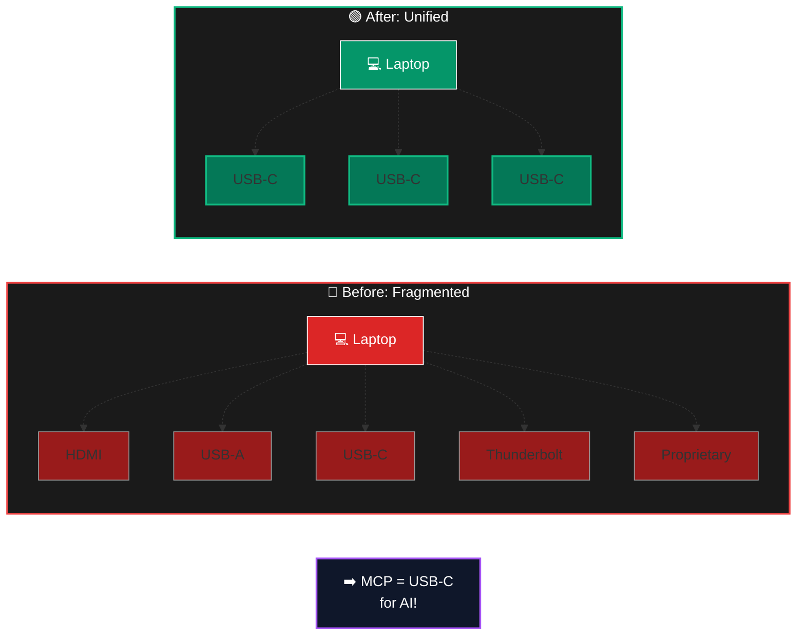
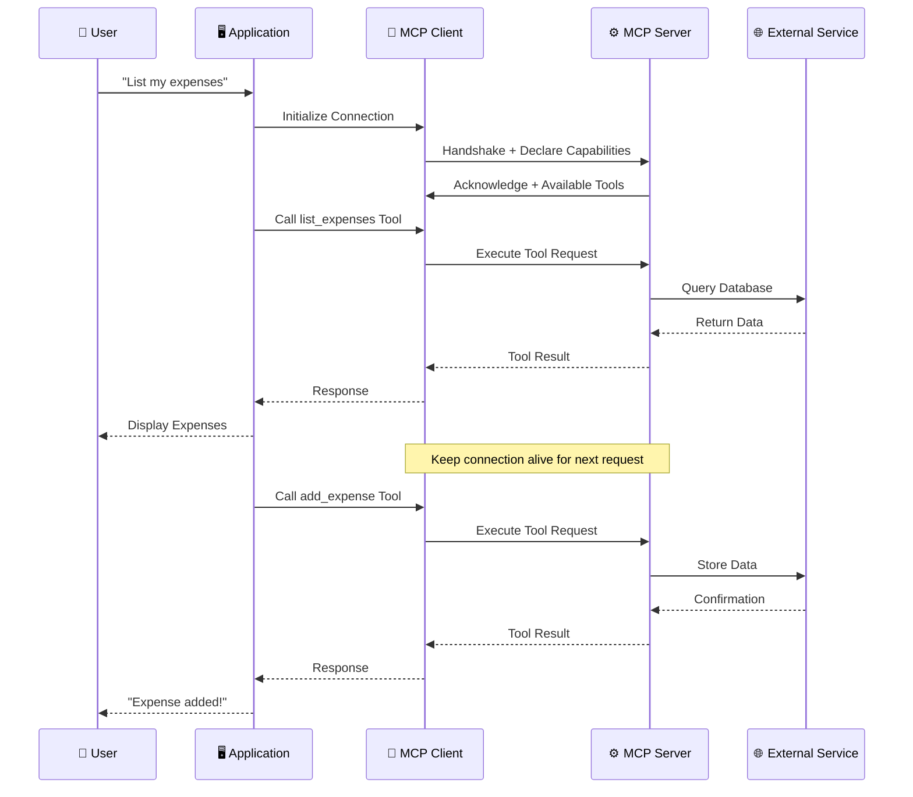

# Mermaid Diagrams for MCP Blog

Use these Mermaid definitions to generate technical diagrams for the Model Context Protocol blog.

---

## Diagram 1: N×M Problem (Before & After)



---

## Diagram 2: Three-Layer Architecture



---

## Diagram 3: MCP Protocol Lifecycle



---

## Diagram 4: STDIO vs HTTP Transport Comparison



---

## Diagram 5: Tools vs Resources Comparison



---

## Diagram 6: Real-World MCP Expense Tracker Architecture



---

## Diagram 7: MCP USB-C Analogy



---

## Diagram 8: Client-Server Communication Flow



---

## How to Use These Diagrams

1. **Copy any diagram code** (between the ` ``` ` markers)
2. **Paste into Mermaid editor** at [mermaid.live](https://mermaid.live)
3. **Download as SVG/PNG** or embed directly in your blog
4. **Or render directly in your blog** if using Markdown processor with Mermaid support

## Corresponding Image Prompts

| Diagram            | Image Prompt              | Use Case               |
| ------------------ | ------------------------- | ---------------------- |
| N×M Problem        | `mcp-nxm-problem.png`     | Article hero/header    |
| Architecture       | `mcp-architecture.png`    | Technical overview     |
| Lifecycle          | `mcp-lifecycle.png`       | Protocol explanation   |
| Transports         | `mcp-transports.png`      | Performance comparison |
| Tools vs Resources | `mcp-tools-resources.png` | Concept clarification  |
| Expense Tracker    | `mcp-expense-tracker.png` | Real-world example     |
| USB-C Analogy      | `mcp-usbc-analogy.png`    | Intuitive explanation  |
| Communication      | (Sequence)                | Deep technical dive    |
