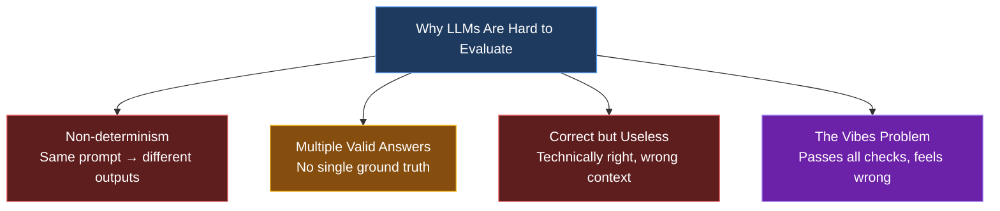
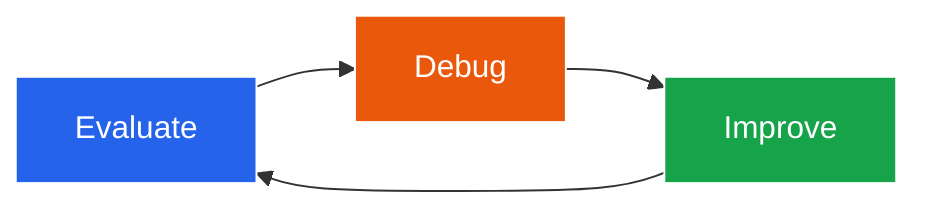
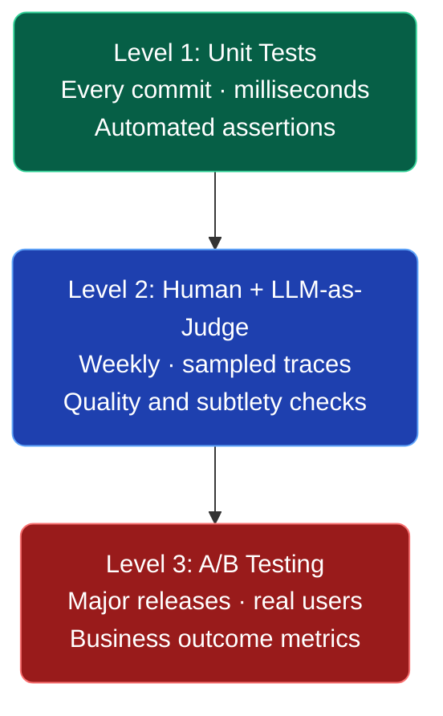
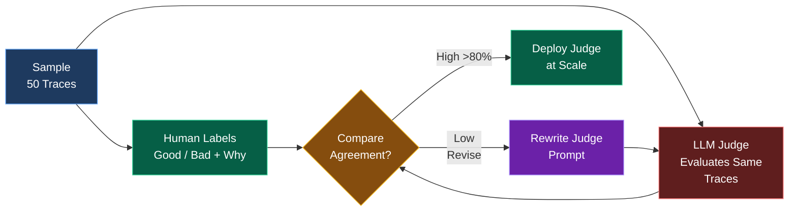
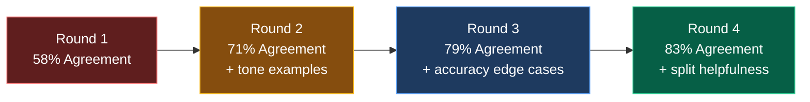
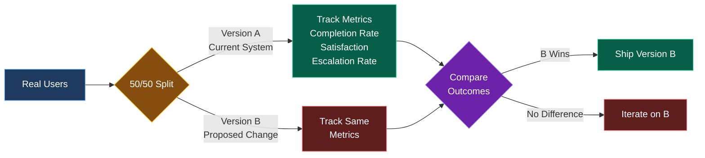
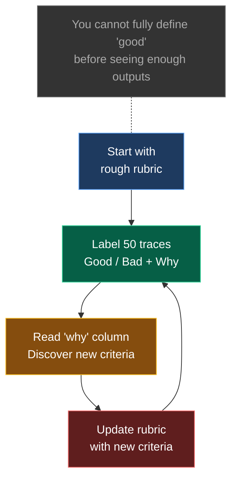

# Your AI Looks Great in Testing. Here's Why That Doesn't Mean Anything.

_Published · June 2026 · 15 min read_

---

You've built something cool. A RAG pipeline, a support bot, a document analyzer. It works perfectly in your test cases. You demo it to your team and it's smooth. You ship it.

Then real users show up.

One weird message trips it up. You patch the prompt. Something else breaks. You patch that. The system prompt balloons to 3,000 tokens and you're not entirely sure what's load-bearing anymore. You switch from GPT-4o to Claude to Gemini hoping the new model just... fixes it. Sometimes it helps. Mostly it shifts where the failures happen.

A few weeks in, you're playing whack-a-mole with edge cases, the prompt has become a wall of special instructions, and you genuinely can't tell if version 14 is better than version 8.

This isn't a model problem.

It's a measurement problem. You can't systematically improve something you can't systematically evaluate.

This post is about fixing that — not with a fancy observability platform or a PhD in NLP, but with a practical framework you can start using this week. We'll go from "how do I even know if this is working" to a real eval system in three levels.

---

## Why LLMs Are Uniquely Hard to Evaluate

Before building an eval system, it helps to understand why evaluation is harder for LLMs than for everything else you've probably built.

With traditional software, wrong is wrong. A function that returns `null` when it should return `42` fails deterministically, every time. You write a unit test, it catches regressions, life is good. The definition of "correct" is unambiguous and encodable.

LLMs don't work like that. A few properties that make evaluation genuinely hard:

**Non-determinism.** The same prompt, same model, same temperature can return meaningfully different outputs on consecutive calls. What passed your manual check yesterday might fail it tomorrow.

**Multiple valid answers.** For most tasks, there isn't one correct response — there's a space of acceptable ones. "Summarize this document" has hundreds of valid outputs and no ground truth to compare against.

**Correct but useless.** A response can be factually accurate, grammatically perfect, and completely miss what the user needed. It answered the question asked rather than the question meant. This is especially common in support and assistant contexts.

**The vibes problem.** And here's the one that gets people: a response can pass every objective check and still just feel wrong. Wrong tone, wrong register, too formal, too casual, technically correct but weirdly cold. "Vibes are off" sounds unscientific, but it's a real failure mode, and one of the hardest to measure.

There's also a deeper issue that Shreya Shankar's research at UC Berkeley surfaced — you often don't fully know what "good" means until you've seen enough model outputs to develop intuitions about it. More on that later.

The point is: evaluating LLM systems is a genuine engineering problem that requires deliberate design. It doesn't happen automatically, and no model is good enough to skip it.



---

## The Loop Most People Skip

When something breaks in an AI system, the instinct is to fix it directly. Tweak the prompt. Try a different model. Add more context to the RAG chunk. This is the "Change Behavior" step, and it's where almost everyone spends 90% of their time.

The problem: behavior change without measurement is just guessing. You don't know if your change made things better overall, or if it fixed one failure and introduced two others you haven't discovered yet.

Hamel Husain, who's consulted on LLM systems at companies across the industry, puts this directly: **unsuccessful AI products almost always share a single root cause — a failure to build evaluation systems.** Most teams focus exclusively on improving behavior, which is exactly why their products never get past demo quality. The demo works. The product doesn't.

The real improvement loop looks like this:

```
Evaluate → Debug → Improve → repeat
```

Evaluation is what makes the other two steps meaningful. Without it, you're not running a loop — you're just making changes and hoping.

Here's the thing that makes this more actionable: **eval infrastructure and debugging infrastructure are almost the same thing.** When you build a system to log and review traces for evaluation, you've also built the system you need to debug production issues. When you build unit tests for evaluation, you've also built a regression suite. The upfront investment pays off in multiple ways simultaneously.

The goal of this post is to get you through each level of that loop, starting from zero.



---

## A Concrete Example We'll Use Throughout

To make this less abstract, let's use a running example: an AI customer support agent for a SaaS product. Users ask questions, the agent retrieves relevant docs via RAG, and responds.

The kinds of failures you'd see in a system like this:

- Returns the right answer but for the wrong product tier
- Hallucinates a feature that doesn't exist
- Answers a billing question with technical documentation
- Gives a correct answer in a tone that reads as dismissive
- Formats the response as a bullet list when the user asked a yes/no question

Some of these are checkable with code. Some require human judgment. Some you won't even notice until you've read 200 traces. This spectrum is what the three-level eval system is designed to cover.

---

## The Three Levels of Evals

Think of evaluation as a pyramid. The bottom is cheap, fast, and runs constantly. The top is expensive, slow, and used rarely. You build from the bottom up — not because the top isn't important, but because without the bottom, the top doesn't mean anything.



---

### Level 1 — Unit Tests

Unit tests for LLMs are fast, automated assertions. Same concept as pytest — you define what a correct output looks like, and the test checks whether the model output satisfies that definition. They run on every code change, take milliseconds, and catch regressions before they reach users.

A few things that make LLM unit tests different from regular ones:

**You don't need 100% pass rate.** Unlike normal software where a failing test means something is broken, LLM test pass rates are a product decision. If your support bot fails to classify billing questions correctly 3% of the time, that might be acceptable. 30% probably isn't. You decide the threshold based on what failures you can tolerate.

**They're reusable beyond testing.** The same assertions you write for tests can be used inline during inference — if the model output fails validation, you retry with the error message as feedback. One assertion, two uses.

**LLMs can help you write them.** Stuck on what to test? Describe your feature to the model and ask it to brainstorm edge cases, adversarial inputs, and scenarios likely to cause failures. It's surprisingly good at this.

**They should get harder over time.** Every production failure you discover becomes a new test. Your test suite should grow with your understanding of where the system fails.

Here's a concrete example for the support agent:

```python
def test_ticket_categorization():
    ticket = "My credit card was charged twice this month"
    result = categorize_ticket(ticket)

    # Structural checks
    assert result.category in ["billing", "technical", "general"]
    assert isinstance(result.confidence, float)
    assert 0 <= result.confidence <= 1

    # Semantic check
    assert result.category == "billing"

def test_no_feature_hallucination():
    query = "Does your product support real-time collaboration?"
    result = answer_support_query(query)

    # Product doesn't have this feature — check it says so
    assert "not available" in result.lower() or "don't currently" in result.lower()
    assert "real-time collaboration" not in result.lower() or "not" in result.lower()

def test_response_format_compliance():
    query = "Is my account active?"
    result = answer_support_query(query)

    # Yes/no questions shouldn't return bullet lists
    assert not result.strip().startswith("-")
    assert not result.strip().startswith("•")
    assert len(result.split("\n")) < 5  # shouldn't be multi-paragraph
```

Notice the variety: structural validity, semantic correctness, format compliance. You want tests across all of these, not just "did it return a string."

For generating test *inputs* synthetically, a prompt like this works well:

```
Generate 30 different support tickets a SaaS customer might submit
about billing issues. Include edge cases — confusing cases, angry
tones, vague descriptions, multi-issue tickets. Return as JSON array.
```

Feed those into your assertions and you have a test suite without waiting for production data.

---

### Level 2 — Human Review + LLM-as-Judge

Unit tests cover what you can express as code. Level 2 covers everything else — quality, tone, helpfulness, subtlety, and the failure modes you haven't thought of yet.

This level has three components: logging, looking, and automating.

#### Step 1: Log Your Traces

A trace is a complete record of a single model interaction — the input, any retrieved context, intermediate steps, and the final output. You need these to do anything at Level 2.

If you're using LangChain, LangSmith logs traces automatically. If you're not, a simple database table with columns for `input`, `context`, `output`, `timestamp`, and `session_id` is enough to start. The specific tool doesn't matter much. What matters is that you have data to look at.

For the support agent example, a trace might look like:
- User message: "I've been charged twice, this is ridiculous"
- Retrieved docs: billing FAQ chunks [1], [3], [7]
- System prompt version: v12
- Model: gpt-4o
- Output: "I understand your frustration. Let me look into this..."
- Latency: 1.2s

Log all of this. You'll need it.

#### Step 2: Actually Look at Your Data

This is the step most people skip or dramatically under-invest in. You cannot outsource data inspection. You cannot buy a tool that replaces it. You have to look at real examples with your own eyes.

The principle here is simple: **remove every friction barrier between you and your traces.** If your observability tool has a clunky UI, build a Streamlit app. If filtering is painful, add a column. If you can't see the retrieved context alongside the output, add that. Whatever makes it faster to go through examples, do it.

What you're looking for when you review:
- Failure modes you've never seen before
- Patterns — does the model consistently fail on a specific type of question?
- Cases that pass your unit tests but feel wrong in context
- Surprisingly good outputs worth saving as positive examples

Start by reviewing every trace you generate from your test cases. Then sample from real user traffic once you have it. Hamel's heuristic: keep reading traces until you stop learning things you didn't already know. That usually takes longer than people expect.

One practical suggestion: as you review, label examples as good or bad in a simple spreadsheet. Add a "why" column. That "why" column is the most valuable thing you'll produce at this stage — it becomes your evaluation rubric.

#### Step 3: LLM-as-Judge

Once you've reviewed enough traces to have real intuitions about what good looks like, you can start automating some of that judgment with a more powerful model as your evaluator.

The basic setup: you write a judge prompt that instructs a model (typically GPT-4o or Claude Opus — something more capable than what you're running in production) to evaluate your system's outputs on specific dimensions. It returns a rating and a written critique.

A judge prompt for the support agent might look like:

```
You are evaluating customer support responses from an AI assistant.

For the following interaction, assess the response on three dimensions:

1. ACCURACY: Does the response contain correct information? Does it avoid
   making claims about features or policies that aren't supported?

2. HELPFULNESS: Does it actually solve the user's problem? Does it give
   them a clear path forward, or does it stall with vague reassurances?

3. TONE: Is it professional and empathetic without being sycophantic?
   Does it match the urgency of the user's message?

User message: {user_message}
Agent response: {agent_response}

For each dimension, write 1-2 sentences of critique, then assign:
- PASS if acceptable
- FAIL if not

Return as JSON: {"accuracy": {"critique": "...", "result": "PASS/FAIL"}, ...}
```

This gives you structured, actionable feedback at scale. Run it on every trace and you have a continuous quality signal.

**The critical part: validate your judge against humans.**

An unvalidated LLM judge is just a model confidently critiquing itself. Before you trust it, you need to check whether it agrees with actual human judgment.

The workflow:

1. Take 30–50 traces
2. Run your judge on all of them
3. Have a human (ideally you, ideally someone who knows the domain) label the same examples with good/bad and a written reason
4. Measure how often the judge and human agree
5. Look at every disagreement — the judge said PASS, human said FAIL, why?
6. Rewrite the judge prompt to address the gaps
7. Repeat until agreement is high enough to trust (~80%+ as a rough starting point)



A spreadsheet is the right tool for this. Columns: input, output, judge critique, judge label, human critique, human label, agreement (yes/no). Track the agreement rate across rounds. Here's what a few rounds of this actually looks like in practice:

| Round | Judge Prompt Changes | Agreement |
|-------|----------------------|-----------|
| 1 | Initial version | 58% |
| 2 | Added examples of what FAIL looks like for tone | 71% |
| 3 | Clarified accuracy definition for edge cases | 79% |
| 4 | Split helpfulness into two separate criteria | 83% |



This process takes time but it's worth it. Once your judge is aligned, it can process thousands of traces a week. You can't.

One important note: **start with binary labels (good/bad), not scores.** "Helpfulness: 4.2/5" is almost impossible to act on. "Bad — gave accurate information but didn't tell the user what to do next" tells you exactly what to fix. Granular scores feel more rigorous but produce less useful signal.

---

### Level 3 — A/B Testing

This level is for mature products only. Don't jump here too early.

A/B testing for LLM systems means running controlled experiments with real users — half get version A (current system), half get version B (proposed change), and you measure which produces better outcomes on metrics you care about.

The key word is "outcomes" — not model-level metrics. You're not measuring whether version B produces higher judge scores. You're measuring whether it improves the things your business actually cares about:

- **Task completion rate** — did the user get what they came for?
- **Follow-up question rate** — a high rate suggests the first answer didn't fully resolve things
- **User satisfaction** — explicit ratings, thumbs up/down, CSAT
- **Escalation rate** — in a support context, how often does AI hand off to a human?
- **Time to resolution** — how many turns does it take to close an issue?

When to use it: when your product is stable enough that you're making deliberate changes to specific components, not firefighting. When you want to validate that a change that looks good in Level 2 evals actually moves real user behavior. When the stakes of a wrong decision are high enough to justify the overhead.

When *not* to use it: when you're still discovering failure modes. When your system changes week to week. When you don't have enough traffic to reach statistical significance in a reasonable time. In those cases, more Level 1 and Level 2 work will give you faster, cleaner signal.



---

## The Criteria Drift Problem

Here's a finding from the research that changes how you should think about building eval systems.

The intuitive approach is: define your evaluation criteria upfront, build a rubric, then measure outputs against it. Clear, systematic, clean. The problem is that this model doesn't match how evaluation actually works in practice.

Shreya Shankar at UC Berkeley ran a study on how practitioners build LLM evaluators (published at UIST 2024, where it was the most cited paper of the conference). What they found was a catch-22 they named **criteria drift**:

> *Users need criteria to grade outputs, but grading outputs helps users define criteria.*

In other words — you can't fully specify what "good" means before you've seen enough model outputs to develop intuitions about what "good" looks like. Some of your evaluation criteria will be output-dependent. They don't exist in the abstract; they only become visible when you're looking at real examples.

Here's a concrete version of this: you build a support agent and your initial rubric says "responses should be helpful and accurate." After reviewing 200 real traces, you discover a new failure mode — the model sometimes gives technically correct answers that don't account for the user's plan tier. That criterion wasn't in your original rubric because you'd never seen the failure. It emerged from looking at data.

The practical implications:

**Don't try to design a perfect rubric on day one.** Start with a rough sense of what good looks like (accurate, helpful, appropriate tone) and label examples with that rough rubric. Your rubric will get more specific as you see more data.

**Your "why" column is your rubric.** Every time you label something as bad, write down why. After 50 examples, read all the "why" entries. That's your real rubric — the one that emerged from actual outputs rather than abstract principles.

**Expect your judge prompt to need many revisions.** The first version will miss things the fifth version catches. Each round of human-judge comparison will surface new criteria you didn't think to include. This is normal and expected.

**Be skeptical of tools that ask you to define all criteria upfront.** If an eval platform's workflow is "define rubric → automate evaluation → done," it's assuming your criteria are stable and complete from the start. They aren't. The definition and the measurement are entangled processes, not sequential ones.

This also means the "look at lots of data" step isn't just for finding failure modes — it's actively part of building your evaluation criteria. The inspection and the rubric-building happen together.



---

## What Good LLM-as-Judge Prompts Actually Look Like

This deserves its own section because the quality of your judge prompt is the main thing that determines whether your Level 2 eval system is useful or noise.

A few patterns that work well:

**Be specific about failure modes, not just success criteria.** Instead of "responses should be accurate," write "responses FAIL on accuracy if they reference features the product doesn't have, cite incorrect pricing, or make definitive statements about account state without qualifying that the user should verify."

**Ask for critique before verdict.** Having the judge write out its reasoning before assigning pass/fail dramatically improves consistency. It's the same mechanism as chain-of-thought prompting — externalizing the reasoning makes it better.

**Evaluate one dimension at a time.** A judge prompt that asks about accuracy, helpfulness, tone, and format simultaneously produces muddier results than four separate prompts. The model tries to average across dimensions and you lose resolution on each one.

**Use concrete examples.** "Here's an example of a response that FAILs on tone: [example]. Here's one that PASSes: [example]." One-shot or few-shot judge prompts outperform zero-shot ones significantly.

**Include the full context.** The judge should see everything the model saw — the user message, the retrieved context, the system prompt version. A response that's appropriate given certain retrieved context might be wrong given different context. Without the full trace, the judge can't tell.

---

## Common Mistakes

**Buying tools before looking at data.** LangSmith, Weave, Braintrust, Arize — these are all genuinely useful. But they can't tell you what failure modes look like in your system. That requires human eyes on real examples. If you haven't manually reviewed 50 traces, you're not ready for an observability platform. You don't know what to look for yet.

**Generic metrics nobody acts on.** If your weekly eval report shows "helpfulness: 4.2, accuracy: 4.5" — what do you do with that? The useful metric is one that points to a specific, fixable problem. "Billing questions resolved on first response: 62%" is actionable. "Helpfulness: 4.2" is not.

**Unvalidated LLM judges.** If you haven't checked whether your judge agrees with human judgment on a sample of examples, you don't have an eval system — you have a model confidently critiquing itself. The number it produces is not a quality signal until it's been validated.

**One-and-done rubric design.** Writing a judge prompt once and never updating it. Your system changes, your users change, the failure modes change. Your eval criteria should evolve with the product. Expect to revise your judge prompt every few weeks, especially early on.

**Waiting for production data to start.** You can generate synthetic test cases right now. A prompt like "generate 40 different ways a user might ask about billing, including confused, angry, and edge case inputs" gets you a real test suite before a single user has touched your product.

**Optimizing for eval, not for users.** Once you have an automated judge, there's a temptation to optimize prompts specifically to score well on the judge rather than to actually help users. The antidote is periodic human review — never fully stopping the manual trace inspection even after you've automated most of it.

---

## Where to Start Tomorrow

You don't need a framework. You need a starting point.

**This week:**

1. **Pick your worst-known failure mode** — the thing that breaks most often, or that you're most nervous about
2. **Write 3 unit test assertions around it** — structural check, semantic check, format check
3. **Log 50 traces** — real usage if you have it, synthetic if you don't
4. **Label them good/bad in a spreadsheet** — add a "why" column for every bad label

**Next week:**

5. **Read your "why" column** — write a judge prompt based on what you found
6. **Run the judge on the same 50 examples** — measure agreement with your labels
7. **Revise the judge prompt** for every disagreement
8. **Add 3 more unit tests** based on the failure modes you found in the traces

That's it. That's a real eval system. It will feel underwhelming relative to the problem it solves. That's fine.

The value compounds. Every failure mode you discover becomes a unit test. Every round of human labeling improves your judge. Every metric you add gives you more signal when you make a change. Three months from now, you'll be able to say "version 14 is 18% better than version 8 on billing question resolution rate" instead of "version 14 feels better, I think."

The teams shipping reliable AI products aren't using better models than everyone else. They're running this loop faster. That's the whole game.

---

## Further Reading

- [Your AI Product Needs Evals](https://hamel.dev/blog/posts/evals/) — Hamel Husain. The Rechat case study this post draws heavily from. Has the flywheel diagram and real screenshots from their eval tooling. Worth reading in full.
- [Task-Specific LLM Evals that Do & Don't Work](https://eugeneyan.com/writing/evals/) — Eugene Yan. Deep survey of eval techniques across different task types — summarization, classification, extraction, RAG. Good reference for when you're designing evals for a specific feature.
- [Who Validates the Validators?](https://arxiv.org/abs/2404.12272) — Shankar et al., UIST 2024. The criteria drift paper. Short, accessible, and the most cited paper at the conference that year. Changes how you think about rubric design.
- [LLM-as-a-Judge: A Complete Guide](https://www.evidentlyai.com/llm-guide/llm-as-a-judge) — Evidently AI. Practical guide to writing, validating, and maintaining judge systems. Good complement to the Hamel post for Level 2.

---

_If you're building something with LLMs and want to talk evals, RAG, or agentic systems — find me on [Twitter](https://twitter.com/YashMah11) or check out my other posts._