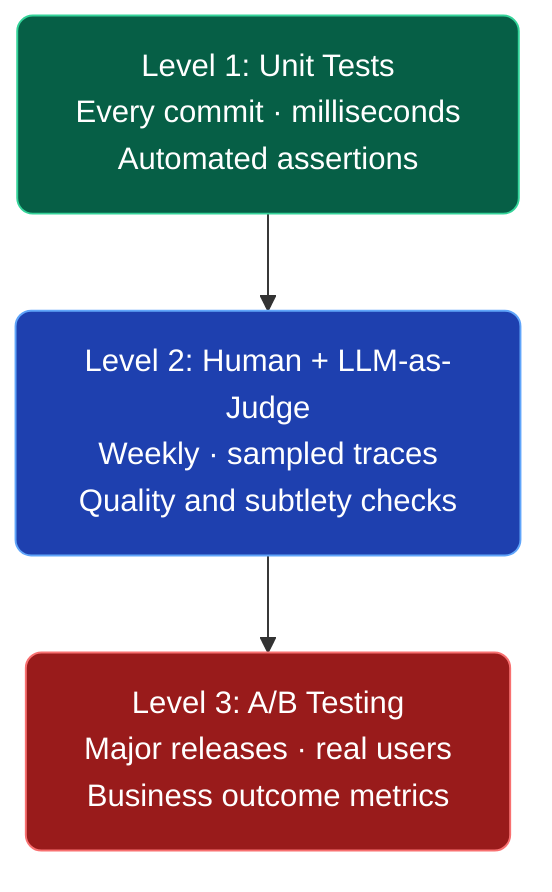
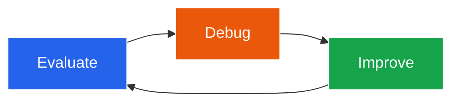
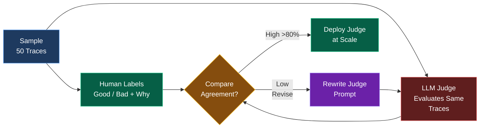
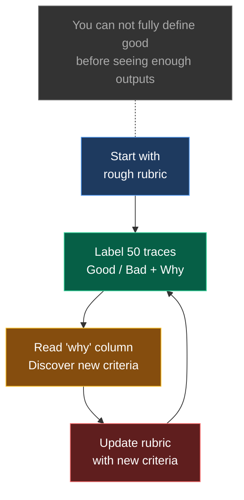
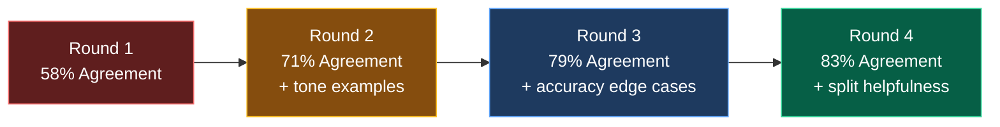
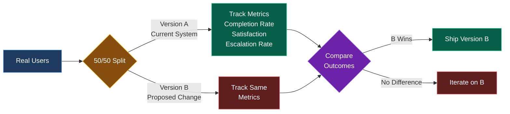
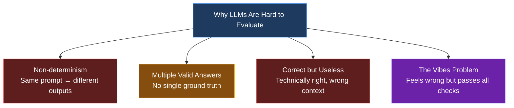

# Mermaid Diagrams for LLM Evals Blog

Use these Mermaid definitions to generate diagrams or visualize the concepts described in the blog post.

---

## Diagram 1: The Three Levels of Evals (Pyramid)

---

## Diagram 2: The Evaluate → Debug → Improve Loop

---

## Diagram 3: LLM-as-Judge Validation Workflow

---

## Diagram 4: Criteria Drift

---

## Diagram 5: Judge Prompt Refinement Rounds

---

## Diagram 6: A/B Testing Flow

---

## Diagram 7: LLM Evaluation Challenges

