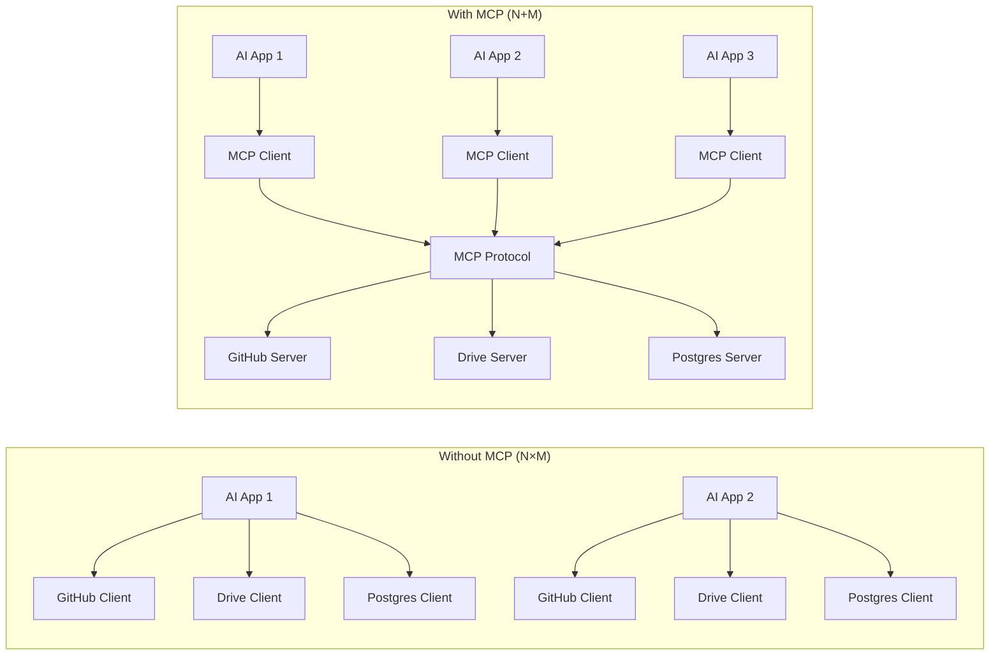
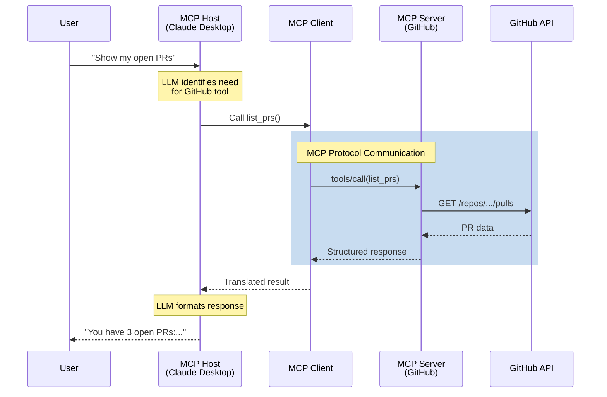
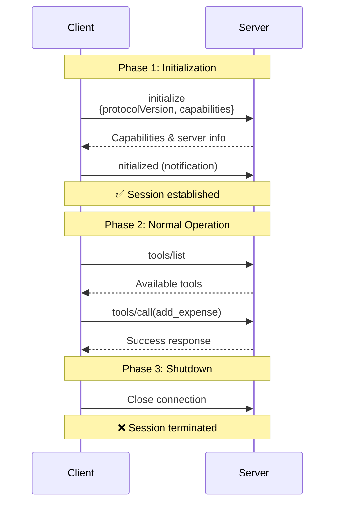
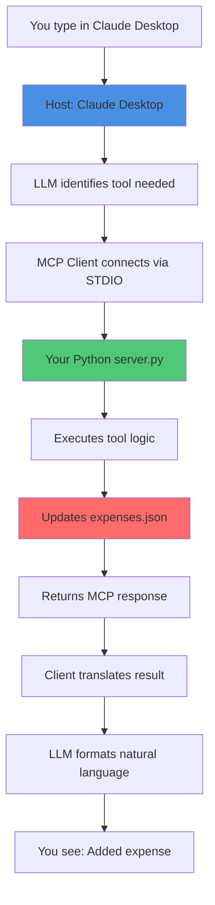
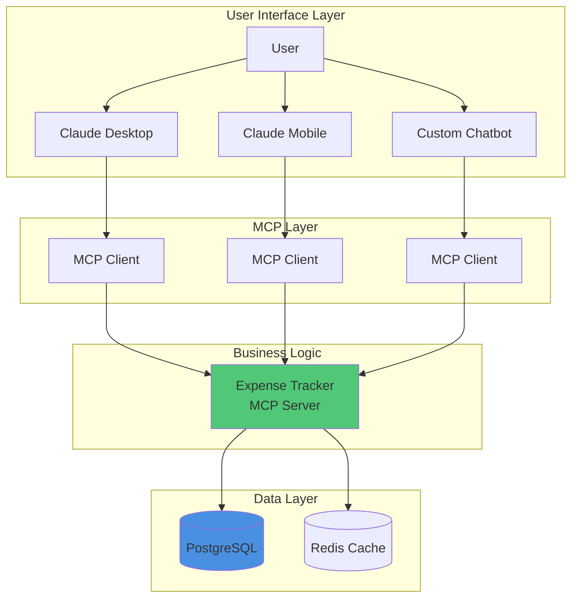

## The Integration Nightmare

You build an AI chatbot. You want it to read files from Google Drive, query your PostgreSQL database, search the web, send Slack messages, and access GitHub repos.

So you write custom code for each one. Five different APIs. Five different authentication flows. Five different error handling patterns. Five maintenance headaches.

Now multiply that by every AI application you build.

This is the N×M problem. And it's exhausting.

```
Your AI App → Custom GitHub integration
Your AI App → Custom Drive integration
Your AI App → Custom Postgres integration
Your AI App → Custom Slack integration
Your AI App → Custom everything integration

Another AI App? Start over.
```

Enter Model Context Protocol (MCP).

## MCP 101: What You Need to Know

MCP is an open protocol that standardizes how AI applications connect to external systems. Released by Anthropic in November 2024, it's already supported by Claude, and adoption is growing across OpenAI, Google DeepMind, and other platforms.

**The USB-C analogy is accurate:** Just as USB-C provides a standard connector for devices, MCP provides a standard protocol for AI-to-data connections.

**What MCP actually is:**

- A communication protocol (like HTTP, WebSocket, or gRPC)
- A standard for capability discovery
- A session lifecycle specification
- JSON-RPC based message format

**What MCP is NOT:**

- A framework or library
- An LLM reasoning system
- A prompt engineering tool
- A UI or workflow manager

Think of MCP like WSGI for Python web apps—it's infrastructure, not intelligence.

## The N×M → N+M Solution




Write each MCP server once. Every MCP-compatible client can use it. N applications + M servers = N+M implementations.

## Architecture: The Three Players


MCP follows a strict three-layer architecture. Understanding this is critical.

### 1. Host (The Restaurant Owner)

The AI application your users interact with.

**Examples:**

- Claude Desktop
- VS Code with MCP extension
- Cursor IDE
- Your custom AI chatbot

**What hosts do:**

- Display UI to users
- Run the LLM (Claude, GPT-4, etc.)
- Manage multiple MCP clients
- Orchestrate which tools to use
- Format responses back to users

```python
# Conceptual (not actual implementation)
class MCPHost:
    def __init__(self):
        self.clients = []  # Multiple clients
        self.llm = ClaudeModel()

    def handle_user_message(self, message):
        # LLM decides what tools are needed
        tools_needed = self.llm.analyze(message)

        # Execute via appropriate clients
        for tool in tools_needed:
            client = self.find_client_for_tool(tool)
            result = client.call_tool(tool.name, tool.args)

        return self.llm.format_response(results)
```

### 2. Client (The Phone System)

The mandatory intermediary. This is crucial: **hosts never talk directly to servers**.

**Key constraint:** One client per server. If your host uses three servers, it creates three clients.

**Why this matters:**

| Benefit                 | Explanation                                      |
| ----------------------- | ------------------------------------------------ |
| **Fault isolation**     | Server crash doesn't affect other connections    |
| **Security boundaries** | Each client-server pair has isolated permissions |
| **Parallel execution**  | Independent request handling per server          |
| **State encapsulation** | No shared state, no cross-tool interference      |

**What clients do:**

- Speak the MCP protocol
- Convert host requests → MCP JSON-RPC messages
- Convert MCP responses → host-usable data
- Manage connection lifecycle
- Handle capability negotiation

```python
# MCP Client responsibilities
class MCPClient:
    def __init__(self, server_connection):
        self.connection = server_connection
        self.capabilities = None
        self.tools = []

    async def initialize(self):
        # Mandatory handshake
        response = await self.send_initialize()
        self.capabilities = response["capabilities"]
        self.tools = await self.discover_tools()

    async def call_tool(self, name, arguments):
        # Convert to MCP format
        request = {
            "jsonrpc": "2.0",
            "method": "tools/call",
            "params": {"name": name, "arguments": arguments}
        }
        return await self.send(request)
```

### 3. Server (The Kitchen)

The program that exposes capabilities and does actual work.

**Focused responsibility:** Each server handles one domain (GitHub, files, databases, etc.)

**What servers do:**

- Advertise capabilities (tools, resources, prompts)
- Execute tool requests
- Access data (local files, remote APIs, databases)
- Return structured responses

**Example servers:**

- `filesystem-server`: Read/write local files
- `github-server`: Access GitHub API
- `postgres-server`: Query databases
- `weather-server`: Fetch weather data

```python
# Simplified MCP Server
from mcp.server import Server

server = Server("my-server")

@server.list_tools()
async def list_tools():
    return [
        {
            "name": "add_expense",
            "description": "Add an expense to the tracker",
            "inputSchema": {
                "type": "object",
                "properties": {
                    "amount": {"type": "number"},
                    "category": {"type": "string"}
                }
            }
        }
    ]

@server.call_tool()
async def call_tool(name, arguments):
    if name == "add_expense":
        # Execute the tool
        db.insert(arguments)
        return {"success": True}
```

## How They Work Together



**The flow in plain terms:**

1. User asks Claude Desktop: "Add a meeting to my calendar for tomorrow at 2pm"
2. Host (Claude Desktop) runs LLM, which thinks: "I need the calendar tool"
3. Host tells the appropriate MCP Client: "Call the add_event tool"
4. Client converts this to MCP protocol format (JSON-RPC)
5. Server receives request, adds event to calendar file/database
6. Server returns structured response via MCP
7. Client translates response back to host format
8. Host's LLM generates natural language: "I've added the meeting to your calendar"
9. User sees the final response

## Protocol Lifecycle: Three Phases


MCP sessions follow a strict lifecycle. Understanding this prevents debugging hell.

### Phase 1: Initialization (The Handshake)

**Hard rule:** No tool or resource calls allowed before initialization completes. Violate this, your connection fails.



**Initialization message:**

```json
// Client → Server
{
  "jsonrpc": "2.0",
  "method": "initialize",
  "id": 1,
  "params": {
    "protocolVersion": "2024-11-05",
    "capabilities": {
      "tools": {"listChanged": true},
      "resources": {"subscribe": true}
    },
    "clientInfo": {
      "name": "my-client",
      "version": "1.0.0"
    }
  }
}

// Server → Client
{
  "jsonrpc": "2.0",
  "id": 1,
  "result": {
    "protocolVersion": "2024-11-05",
    "capabilities": {
      "tools": {},
      "resources": {}
    },
    "serverInfo": {
      "name": "expense-tracker",
      "version": "1.0.0"
    }
  }
}
```

**What's negotiated:**

- Protocol version (both must agree)
- Capabilities (what each side supports)
- Implementation metadata (names, versions)

**Then:** Client sends `initialized` notification. Now the session is live.

### Phase 2: Normal Operation

This is where actual work happens:

**Tool discovery:**

```json
// Client: What can you do?
{"method": "tools/list"}

// Server: Here are my tools
{
  "tools": [
    {
      "name": "add_expense",
      "description": "Add expense to tracker",
      "inputSchema": {...}
    },
    {
      "name": "list_expenses",
      "description": "Query expenses",
      "inputSchema": {...}
    }
  ]
}
```

**Tool execution:**

```json
// Client: Execute this
{
  "method": "tools/call",
  "params": {
    "name": "add_expense",
    "arguments": {
      "amount": 42.50,
      "category": "food"
    }
  }
}

// Server: Done
{
  "content": [
    {
      "type": "text",
      "text": "Added expense: $42.50 (food)"
    }
  ]
}
```

**Resource access:**

```json
// Client: Give me this resource
{
  "method": "resources/read",
  "params": {
    "uri": "file:///expenses/january.json"
  }
}

// Server: Here it is
{
  "contents": [
    {
      "uri": "file:///expenses/january.json",
      "mimeType": "application/json",
      "text": "{...expense data...}"
    }
  ]
}
```

### Phase 3: Shutdown

Session ends when either side terminates. Connection closes. To use the server again, full initialization required.

## Tools vs Resources: Critical Distinction


MCP defines two types of capabilities. Choosing the right one matters.

| Aspect           | Tool                        | Resource                   |
| ---------------- | --------------------------- | -------------------------- |
| **Side effects** | Yes (modifies state)        | No (read-only)             |
| **Invocation**   | Active (explicit call)      | Passive (data retrieval)   |
| **Use case**     | Actions                     | Context/Information        |
| **Example**      | `add_expense`, `send_email` | `read_file`, `get_profile` |
| **Caching**      | Unsafe                      | Safe                       |
| **Idempotency**  | Often not idempotent        | Idempotent                 |

**Tool example (side effects):**

```python
@server.tool()
async def send_slack_message(channel: str, text: str):
    # Modifies state: sends a message
    slack_client.post_message(channel, text)
    return {"sent": True}
```

**Resource example (read-only):**

```python
@server.resource("file:///{path}")
async def read_file(path: str):
    # No side effects: just returns data
    content = filesystem.read(path)
    return {
        "uri": f"file:///{path}",
        "mimeType": "text/plain",
        "text": content
    }
```

**Why this matters:**

- LLMs can aggressively cache resource responses
- Tools must be called fresh each time
- Resources enable efficient context loading
- Tools enable AI to take actions

## Transport Layer: How Data Actually Moves

Transport is orthogonal to MCP protocol semantics. Same protocol, different delivery mechanisms.

### STDIO Transport (Local Servers)


**What it is:** Standard input/output pipes between processes.

**When to use:**

- Local development
- Desktop applications
- Single-machine deployments
- Maximum security (never leaves your computer)

**How it works:**

```
┌─────────────────┐    stdin/stdout    ┌─────────────────┐
│   Claude        │◄──────────────────►│  Your Server    │
│   Desktop       │      (pipes)       │   Process       │
│   (Host)        │                    │                 │
└─────────────────┘                    └─────────────────┘
   Parent process                      Child process
```

**Configuration:**

```json
// claude_desktop_config.json
{
  "mcpServers": {
    "my-server": {
      "command": "python",
      "args": ["/path/to/server.py"]
    }
  }
}
```

**Code:**

```python
from mcp.server.stdio import stdio_server

async def main():
    async with stdio_server() as (read_stream, write_stream):
        await server.run(
            read_stream,
            write_stream,
            server.create_initialization_options()
        )
```

**Pros:**

- ✅ Ultra-low latency (<1ms)
- ✅ No network configuration
- ✅ Maximum security (local-only)
- ✅ Simple setup

**Cons:**

- ❌ Server must run on same machine
- ❌ Can't share across team
- ❌ Harder to scale

### HTTP + SSE Transport (Remote Servers)

**What it is:** HTTP for requests, Server-Sent Events for streaming responses.

**When to use:**

- Remote/cloud servers
- Team collaboration
- Long-running operations with progress updates

**How it works:**

```
┌─────────────────┐    HTTP/SSE      ┌─────────────────┐
│   Claude        │◄───────────────►│  Your Server    │
│   Desktop       │  (over internet) │  cloud.com      │
└─────────────────┘                  └─────────────────┘
```

**Code:**

```python
from mcp.server.sse import SseServerTransport
from starlette.applications import Starlette

app = Starlette()
sse = SseServerTransport("/messages")

@app.route("/sse")
async def handle_sse(request):
    async with sse.connect_sse(
        request.scope,
        request.receive,
        request._send
    ) as streams:
        await server.run(streams[0], streams[1], init_options)
```

**Configuration:**

```json
{
  "mcpServers": {
    "remote-server": {
      "url": "https://my-server.com/sse",
      "transport": "sse"
    }
  }
}
```

**Pros:**

- ✅ Remote access
- ✅ Real-time streaming
- ✅ Multiple clients simultaneously

**Cons:**

- ❌ Requires hosted server (AWS, Render, etc.)
- ❌ Network latency (20-100ms)
- ❌ More complex setup

### Streamable HTTP Transport (Serverless)

**What it is:** HTTP requests with streaming responses, designed for serverless platforms.

**When to use:**

- Vercel, Cloudflare Workers, AWS Lambda
- Production APIs
- No long-running server needed

**Code (Vercel example):**

```typescript
// api/mcp.ts
import { Server } from "@modelcontextprotocol/sdk/server";
import { StreamableHTTPTransport } from "@modelcontextprotocol/sdk/server/http";

export const config = { runtime: "edge" };

const server = new Server({ name: "serverless-mcp", version: "1.0.0" });

export default async function handler(req: Request) {
  const transport = new StreamableHTTPTransport();
  return transport.handleRequest(req, server);
}
```

**Configuration:**

```json
{
  "mcpServers": {
    "serverless": {
      "url": "https://your-project.vercel.app/api/mcp"
    }
  }
}
```

**Pros:**

- ✅ Serverless-friendly
- ✅ Auto-scaling
- ✅ Simple URL-based config

**Cons:**

- ❌ Cold start latency (50-200ms)
- ❌ Stateless (each request independent)

**Comparison:**

| Feature    | STDIO       | HTTP+SSE   | Streamable HTTP |
| ---------- | ----------- | ---------- | --------------- |
| Latency    | <1ms        | 20-100ms   | 50-200ms        |
| Location   | Local only  | Remote     | Remote          |
| Deployment | Simple      | Medium     | Simple          |
| Serverless | ❌          | ❌         | ✅              |
| Best for   | Development | Team tools | Production      |

## Local vs Remote: Deployment Patterns

**Local servers** run on the same machine as the host. **Remote servers** run on external infrastructure.

**Local Server Pattern:**

```python
# server.py
from mcp.server import Server
from mcp.server.stdio import stdio_server

server = Server("expense-tracker")

@server.tool()
async def add_expense(amount: float, category: str):
    # Access local SQLite database
    db = sqlite3.connect("expenses.db")
    db.execute("INSERT INTO expenses VALUES (?, ?)", (amount, category))
    return {"success": True}

async def main():
    async with stdio_server() as (read, write):
        await server.run(read, write, server.create_initialization_options())

if __name__ == "__main__":
    import asyncio
    asyncio.run(main())
```

**Remote Server Pattern:**

```python
# server.py (same logic, different transport)
from mcp.server import Server
from mcp.server.sse import SseServerTransport
from starlette.applications import Starlette
import uvicorn

server = Server("expense-tracker")

@server.tool()
async def add_expense(amount: float, category: str):
    # Access remote PostgreSQL
    db = await asyncpg.connect("postgresql://...")
    await db.execute("INSERT INTO expenses VALUES ($1, $2)", amount, category)
    return {"success": True}

app = Starlette()
sse = SseServerTransport("/sse")

@app.route("/sse")
async def handle(request):
    async with sse.connect_sse(...) as streams:
        await server.run(streams[0], streams[1], init_options)

# Deploy to AWS/Render/etc
uvicorn.run(app, host="0.0.0.0", port=8000)
```

**Key insight:** Logic stays identical. Only transport changes.

## Building Your First MCP Server

Let's build an expense tracker that stores expenses locally and lets Claude query them.

### Prerequisites

```bash
# Install uv (modern Python package manager)
curl -LsSf https://astral.sh/uv/install.sh | sh

# Create project
mkdir expense-tracker-mcp
cd expense-tracker-mcp
uv init
uv venv
source .venv/bin/activate  # Windows: .venv\Scripts\activate

# Install MCP SDK
uv add mcp
```

### Server Implementation

```python
# server.py
from mcp.server import Server
from mcp.server.stdio import stdio_server
from mcp.types import Tool, TextContent
import json
import os
from datetime import datetime

server = Server("expense-tracker")

EXPENSES_FILE = "expenses.json"

def load_expenses():
    if os.path.exists(EXPENSES_FILE):
        with open(EXPENSES_FILE, 'r') as f:
            return json.load(f)
    return []

def save_expenses(expenses):
    with open(EXPENSES_FILE, 'w') as f:
        json.dump(expenses, f, indent=2)

@server.list_tools()
async def list_tools() -> list[Tool]:
    return [
        Tool(
            name="add_expense",
            description="Add a new expense",
            inputSchema={
                "type": "object",
                "properties": {
                    "amount": {
                        "type": "number",
                        "description": "Expense amount"
                    },
                    "category": {
                        "type": "string",
                        "description": "Expense category (food, transport, etc.)"
                    },
                    "description": {
                        "type": "string",
                        "description": "Expense description"
                    }
                },
                "required": ["amount", "category"]
            }
        ),
        Tool(
            name="list_expenses",
            description="List all expenses",
            inputSchema={
                "type": "object",
                "properties": {
                    "category": {
                        "type": "string",
                        "description": "Filter by category (optional)"
                    }
                }
            }
        ),
        Tool(
            name="total_expenses",
            description="Get total expenses, optionally by category",
            inputSchema={
                "type": "object",
                "properties": {
                    "category": {
                        "type": "string",
                        "description": "Category to total (optional)"
                    }
                }
            }
        )
    ]

@server.call_tool()
async def call_tool(name: str, arguments: dict) -> list[TextContent]:
    if name == "add_expense":
        expenses = load_expenses()
        expense = {
            "id": len(expenses) + 1,
            "amount": arguments["amount"],
            "category": arguments["category"],
            "description": arguments.get("description", ""),
            "date": datetime.now().isoformat()
        }
        expenses.append(expense)
        save_expenses(expenses)

        return [TextContent(
            type="text",
            text=f"✅ Added expense: ${expense['amount']} ({expense['category']})"
        )]

    elif name == "list_expenses":
        expenses = load_expenses()
        category = arguments.get("category")

        if category:
            expenses = [e for e in expenses if e["category"] == category]

        if not expenses:
            return [TextContent(
                type="text",
                text="No expenses found."
            )]

        result = "\n".join([
            f"• ${e['amount']} - {e['category']} - {e.get('description', 'N/A')}"
            for e in expenses
        ])

        return [TextContent(
            type="text",
            text=f"Your expenses:\n{result}"
        )]

    elif name == "total_expenses":
        expenses = load_expenses()
        category = arguments.get("category")

        if category:
            expenses = [e for e in expenses if e["category"] == category]

        total = sum(e["amount"] for e in expenses)

        msg = f"Total: ${total:.2f}"
        if category:
            msg += f" ({category})"

        return [TextContent(type="text", text=msg)]

    raise ValueError(f"Unknown tool: {name}")

async def main():
    async with stdio_server() as (read_stream, write_stream):
        await server.run(
            read_stream,
            write_stream,
            server.create_initialization_options()
        )

if __name__ == "__main__":
    import asyncio
    asyncio.run(main())
```

### Configure Claude Desktop

```bash
# Mac
nano ~/Library/Application\ Support/Claude/claude_desktop_config.json

# Windows
notepad %APPDATA%\Claude\claude_desktop_config.json
```

Add your server:

```json
{
  "mcpServers": {
    "expenses": {
      "command": "python",
      "args": ["/full/path/to/expense-tracker-mcp/server.py"]
    }
  }
}
```

Get full path: `pwd` (Mac/Linux) or `cd` (Windows)

### Test It

1. Restart Claude Desktop completely
2. Look for 🔨 (hammer icon) in the interface
3. Try these commands:

```
You: "Add an expense: $45 for groceries"
Claude: ✅ Added expense: $45.0 (food)

You: "Add another expense: $12 for uber, category transport"
Claude: ✅ Added expense: $12.0 (transport)

You: "List all my expenses"
Claude: Your expenses:
• $45.0 - food - groceries
• $12.0 - transport - uber

You: "What's my total spending?"
Claude: Total: $57.00
```

**What just happened:**



All local. No internet. Your data never leaves your machine.

## SDK Evolution: FastMCP vs MCP SDK

When MCP was released, the official SDK was verbose:

```python
# Old MCP SDK (verbose)
from mcp.server import Server
from mcp.server.models import InitializationOptions
import mcp.server.stdio
import mcp.types as types

server = Server("my-server")

@server.list_tools()
async def handle_list_tools() -> list[types.Tool]:
    return [
        types.Tool(
            name="my_tool",
            description="Does something",
            inputSchema={
                "type": "object",
                "properties": {},
                "required": []
            }
        )
    ]

@server.call_tool()
async def handle_call_tool(
    name: str,
    arguments: dict | None
) -> list[types.TextContent | types.ImageContent | types.EmbeddedResource]:
    # Handle tool call
    pass

async def main():
    from mcp.server.stdio import stdio_server
    async with stdio_server() as (read_stream, write_stream):
        await server.run(
            read_stream,
            write_stream,
            InitializationOptions(
                server_name="my-server",
                server_version="1.0.0",
                capabilities=server.get_capabilities(
                    notification_options=NotificationOptions(),
                    experimental_capabilities={},
                )
            )
        )
```

**FastMCP** was created as a Flask-style abstraction:

```python
# FastMCP (clean)
from fastmcp import FastMCP

mcp = FastMCP("My Server")

@mcp.tool()
def my_tool(param: str) -> str:
    """Does something"""
    return f"Result: {param}"

# That's it. FastMCP handles everything else.
```

**Evolution:**

1. MCP protocol released (Nov 2024)
2. MCP SDK introduced (verbose, boilerplate-heavy)
3. FastMCP created independently
4. FastMCP patterns adopted into SDK
5. FastMCP v2 now independent library

**Analogy:**

- MCP SDK ≈ WSGI (protocol implementation)
- FastMCP ≈ Flask (developer-friendly wrapper)

**Current recommendation:** Use FastMCP for rapid development, MCP SDK for full control.

## Connectors: Pre-Configured Servers

Manually configuring servers in `claude_desktop_config.json` works but is tedious. **Connectors** solve this.

**What connectors are:**

- Host-provided wrappers around popular MCP servers
- Pre-configured authentication
- One-click setup
- Curated for reliability

**Example:** Claude Desktop connectors:

- Google Drive (pre-configured OAuth)
- GitHub (managed API keys)
- Slack (automatic workspace detection)

**How they work:**

```
User clicks "Add Google Drive connector"
    ↓
Connector handles OAuth flow
    ↓
Connector creates MCP client → Google Drive MCP server
    ↓
User can now ask: "Summarize my latest Drive doc"
```

**Manual vs Connector:**

| Aspect       | Manual Config    | Connector    |
| ------------ | ---------------- | ------------ |
| Setup        | JSON config file | One-click UI |
| Auth         | You handle       | Automatic    |
| Updates      | Manual           | Auto-updated |
| Availability | Any server       | Curated only |

**When to use manual config:**

- Custom/internal servers
- Development/testing
- Servers without connectors

**When to use connectors:**

- Popular services (Drive, GitHub, Slack)
- Production use
- Non-technical users

## Building MCP Clients

Most developers use existing hosts (Claude Desktop, VS Code). But you can build custom clients.

### Basic Client

```python
from mcp.client import Client
from mcp.client.stdio import stdio_client

async def main():
    # Connect to server via STDIO
    async with stdio_client(
        command="python",
        args=["server.py"]
    ) as (read, write):

        async with Client(read, write) as client:
            # Initialize
            await client.initialize()

            # List available tools
            tools = await client.list_tools()
            print(f"Available tools: {[t.name for t in tools]}")

            # Call a tool
            result = await client.call_tool(
                "add_expense",
                arguments={"amount": 50, "category": "food"}
            )

            print(f"Result: {result.content[0].text}")

import asyncio
asyncio.run(main())
```

### Multi-Server Client

Real power: one client connecting to multiple servers.

```python
from mcp.client import Client
from mcp.client.stdio import stdio_client
from mcp.client.http import http_client

class MultiServerClient:
    def __init__(self):
        self.servers = {}

    async def add_server(self, name, connection):
        """Add a new server connection"""
        async with Client(*connection) as client:
            await client.initialize()
            tools = await client.list_tools()

            self.servers[name] = {
                "client": client,
                "tools": {t.name: t for t in tools}
            }

    async def call_tool(self, server_name, tool_name, arguments):
        """Route tool call to correct server"""
        if server_name not in self.servers:
            raise ValueError(f"Unknown server: {server_name}")

        client = self.servers[server_name]["client"]
        return await client.call_tool(tool_name, arguments)

    def list_all_tools(self):
        """Get all tools from all servers"""
        all_tools = {}
        for server_name, server_data in self.servers.items():
            all_tools[server_name] = list(server_data["tools"].keys())
        return all_tools

# Usage
async def main():
    multi_client = MultiServerClient()

    # Add local expense tracker
    await multi_client.add_server(
        "expenses",
        stdio_client(command="python", args=["expense-server.py"])
    )

    # Add remote GitHub server
    await multi_client.add_server(
        "github",
        http_client(url="https://mcp-github.com/sse")
    )

    # List all available tools
    print(multi_client.list_all_tools())
    # {
    #   "expenses": ["add_expense", "list_expenses"],
    #   "github": ["create_issue", "list_repos"]
    # }

    # Call tool on specific server
    await multi_client.call_tool(
        "expenses",
        "add_expense",
        {"amount": 30, "category": "food"}
    )

    await multi_client.call_tool(
        "github",
        "create_issue",
        {"repo": "my-repo", "title": "Bug report"}
    )
```

### Using LangChain MCP Adapters

For LangChain integration:

```python
from langchain_mcp import MCPToolkit

# Create MCP toolkit
toolkit = MCPToolkit(
    servers=[
        {"name": "expenses", "command": "python", "args": ["server.py"]},
        {"name": "github", "url": "https://mcp-github.com/sse"}
    ]
)

# Get all tools as LangChain tools
tools = toolkit.get_tools()

# Use with LangChain agent
from langchain.agents import create_openai_functions_agent
from langchain_openai import ChatOpenAI

llm = ChatOpenAI(model="gpt-4")
agent = create_openai_functions_agent(llm, tools)

# Now you can use MCP servers in LangChain workflows
```

## Real-World Pattern: AI-Powered Expense Tracker


Let's see how MCP enables natural language interfaces for data management.

**Traditional approach:**

- Build a web form
- Create API endpoints
- Handle authentication
- Build UI for queries
- Maintain separate mobile app

**MCP approach:**

- Build one MCP server
- Expose tools via protocol
- Any MCP host can use it
- Natural language interface for free

### Architecture



### Benefits

**User experience:**

```
User: "How much did I spend on food last month?"
AI: "You spent $342.50 on food in December."

User: "Add an expense: coffee, $4.50"
AI: "✅ Added $4.50 coffee expense."

User: "Show me all transport expenses over $20"
AI: "Found 3 transport expenses over $20:
• Uber - $25.00
• Train ticket - $45.00
• Airport shuttle - $30.00"
```

No forms. No clicking. Just natural language.

**Developer experience:**

- Write server once
- Works with Claude Desktop, mobile, web
- No UI code needed
- Protocol handles everything

**System properties:**

- **Decoupled:** Server logic independent of UI
- **Scalable:** Deploy server remotely, handle multiple clients
- **Testable:** Test server without UI
- **Flexible:** Add new capabilities without client changes

## Deploying Remote Servers

When you're ready for production, deploy your server remotely.

### Option 1: Traditional Hosting (AWS, Render, etc.)

```python
# server.py (production version)
from mcp.server import Server
from mcp.server.sse import SseServerTransport
from starlette.applications import Starlette
from starlette.routing import Route
import uvicorn

server = Server("expense-tracker-prod")

# ... (same tool definitions as before)

app = Starlette()
sse = SseServerTransport("/messages")

async def handle_sse(request):
    async with sse.connect_sse(
        request.scope,
        request.receive,
        request._send
    ) as streams:
        await server.run(
            streams[0],
            streams[1],
            server.create_initialization_options()
        )

app.add_route("/sse", handle_sse)

if __name__ == "__main__":
    uvicorn.run(app, host="0.0.0.0", port=8000)
```

**Deploy:**

```bash
# Render
git push origin main
# Render auto-deploys

# AWS
docker build -t expense-tracker .
docker push ...
# Deploy to ECS/EKS
```

### Option 2: FastMCP Cloud

Free tier, GitHub-based deployment:

```bash
# Install FastMCP CLI
pip install fastmcp

# Login
fastmcp login

# Deploy
fastmcp deploy server.py
# Output: https://your-username-expense-tracker.fastmcp.com
```

**Benefits:**

- Free tier available
- Auto-generated URL
- GitHub integration
- Zero infrastructure setup

### Client Configuration for Remote Server

```json
{
  "mcpServers": {
    "expenses": {
      "url": "https://your-server.com/sse",
      "transport": "sse"
    }
  }
}
```

Now your server is accessible:

- From anywhere
- By multiple users
- Across devices
- With proper scaling

## Key Engineering Properties

MCP provides specific technical guarantees:

**1. Protocol-driven:**

- Standardized message format (JSON-RPC 2.0)
- Versioned protocol
- Capability negotiation
- Language-agnostic

**2. Decoupled architecture:**

- Host ≠ Client ≠ Server
- Each component replaceable
- Clear boundaries

**3. Fault isolation:**

- One server crash doesn't affect others
- 1:1 client-server relationship
- Independent error handling

**4. Horizontal scalability:**

- Add servers without modifying clients
- Add clients without modifying servers
- Parallel execution

**5. Tool standardization:**

- JSON Schema for inputs
- Structured outputs
- Consistent error handling

**6. Transport flexibility:**

- Same protocol, multiple transports
- Deploy anywhere (local, cloud, serverless)
- Choose based on requirements

**Critical insight:** MCP is infrastructure, not intelligence. It doesn't make your AI smarter—it makes your AI more capable by providing standardized access to tools and data.

## Common Patterns and Anti-Patterns

### ✅ Good Patterns

**Single responsibility servers:**

```python
# Good: Focused server
github_server = Server("github")
@github_server.tool()
async def create_issue(...): pass

@github_server.tool()
async def list_repos(...): pass
```

**Clear capability boundaries:**

```python
# Good: Resource for reading, tool for writing
@server.resource("file:///{path}")
async def read_file(path): pass  # No side effects

@server.tool()
async def write_file(path, content): pass  # Side effects
```

**Error handling:**

```python
@server.tool()
async def add_expense(amount, category):
    try:
        validate_amount(amount)
        db.insert(amount, category)
        return {"success": True}
    except ValueError as e:
        raise McpError(
            code=INVALID_PARAMS,
            message=f"Invalid amount: {e}"
        )
```

### ❌ Anti-Patterns

**God servers (don't do this):**

```python
# Bad: One server doing everything
mega_server = Server("everything")
@mega_server.tool()
async def read_file(...): pass

@mega_server.tool()
async def send_email(...): pass

@mega_server.tool()
async def query_database(...): pass

@mega_server.tool()
async def search_web(...): pass
# This defeats the purpose of decoupling
```

**Mixing concerns:**

```python
# Bad: Tool that should be a resource
@server.tool()
async def get_user_profile(user_id):
    # This has no side effects, should be a resource
    return db.query("SELECT * FROM users WHERE id = ?", user_id)
```

**Ignoring initialization:**

```python
# Bad: Skipping initialization phase
client = Client(read, write)
# Don't do this:
tools = await client.list_tools()  # Will fail!

# Always initialize first:
await client.initialize()
tools = await client.list_tools()  # Now works
```

## Comparison with Alternatives

**MCP vs Function Calling:**

| Aspect          | MCP                          | Function Calling   |
| --------------- | ---------------------------- | ------------------ |
| Scope           | Protocol for tool access     | LLM feature        |
| Standardization | Universal protocol           | Provider-specific  |
| Discovery       | Runtime capability discovery | Static definitions |
| Transport       | Multiple (STDIO, HTTP, etc.) | N/A (in-process)   |
| Use case        | External systems             | LLM tool use       |

**MCP vs REST APIs:**

| Aspect       | MCP                  | REST APIs                      |
| ------------ | -------------------- | ------------------------------ |
| Purpose      | AI tool integration  | General data access            |
| Discovery    | Automatic            | Manual documentation           |
| Schema       | JSON Schema built-in | OpenAPI (separate)             |
| Streaming    | Native (SSE)         | Requires custom implementation |
| AI-optimized | Yes                  | No                             |

**MCP vs LangChain Tools:**

| Aspect          | MCP                  | LangChain Tools  |
| --------------- | -------------------- | ---------------- |
| Scope           | Protocol + transport | Python functions |
| Language        | Any                  | Python only      |
| Reusability     | Across any MCP host  | LangChain only   |
| Deployment      | Local or remote      | In-process       |
| Standardization | Protocol-level       | Framework-level  |

**When to use MCP:**

- Building reusable tool servers
- Multi-client scenarios
- Cross-language requirements
- Production AI applications

**When NOT to use MCP:**

- Simple in-process function calls
- Prototyping (overkill)
- Single-use scripts

## Debugging MCP Applications

**Common issues:**

**1. Server not connecting:**

```bash
# Check if server process starts
python server.py
# Should wait for input, not crash

# Check config path is absolute
{
  "command": "python",
  "args": ["/full/path/to/server.py"]  # Not relative!
}
```

**2. Tools not appearing:**

```python
# Ensure tools are registered BEFORE server.run()
@server.list_tools()
async def list_tools():
    return [...]  # Must return list

# Check initialization completed
await client.initialize()  # Required!
tools = await client.list_tools()
```

**3. Transport errors:**

```python
# STDIO: Check process spawning
# HTTP: Check server is running and reachable
# Verify transport type matches server implementation
```

**4. JSON-RPC errors:**

```json
// Invalid request (missing id)
{"method": "tools/call"}  // ❌

// Valid request
{"jsonrpc": "2.0", "method": "tools/call", "id": 1}  // ✅
```

**Debugging tools:**

- MCP Inspector (official debugging UI)
- Server logs (add logging statements)
- Client-side error handlers
- Network inspection (for HTTP transports)

## The Bottom Line

MCP solves a specific technical problem: standardizing AI-to-tool communication. It does this through:

1. **Clear architecture:** Host, Client, Server separation
2. **Strict protocol:** JSON-RPC with defined lifecycle
3. **Capability system:** Tools, Resources, Prompts
4. **Transport flexibility:** STDIO, HTTP, Serverless
5. **1:1 client-server model:** Isolation and fault containment

**What MCP enables:**

- Write tool servers once, use everywhere
- N+M instead of N×M integrations
- Natural language interfaces for data
- Decoupled, scalable AI systems

**What MCP doesn't do:**

- Make your LLM smarter
- Handle prompt engineering
- Provide reasoning logic
- Replace your application architecture

MCP is infrastructure. Use it when you need AI to reliably access external systems. The protocol handles the plumbing so you can focus on capabilities.

## Resources

**Official:**

- [MCP Documentation](https://modelcontextprotocol.io/docs)
- [MCP GitHub](https://github.com/modelcontextprotocol)
- [MCP Specification](https://modelcontextprotocol.io/specification)

**SDKs:**

- Python: `pip install mcp`
- TypeScript: `@modelcontextprotocol/sdk`
- FastMCP: `pip install fastmcp`

**Video Series:**

- [CampusX MCP Playlist](https://www.youtube.com/playlist?list=PLKnIA16_Rmva_oZ9F4ayUu9qcWgF7Fyc0) - Architecture, servers, clients, deployment

**Tools:**

- MCP Inspector (debugging UI)
- Official server registry
- Community servers (GitHub, Notion, Linear, Slack)

**Community:**

- GitHub Discussions
- Discord (linked from docs)

---

_MCP is infrastructure, not magic. Build servers. Connect clients. Ship capable AI applications._
